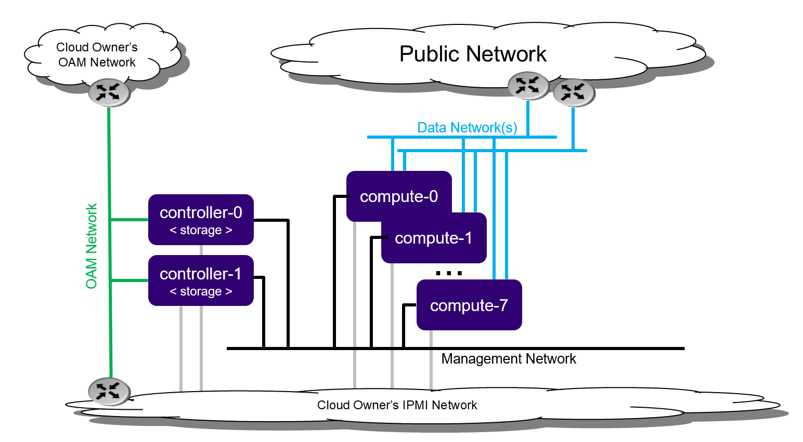

===============================================
Controller storage deployment guide stx.2019.05
===============================================

.. contents::
   :local:
   :depth: 1

**NOTE:**  The instructions to set up a StarlingX Cloud with Controller
Storage with containerized openstack services in this guide
are under development.
For approved instructions, see the
`StarlingX Cloud with Controller Storage wiki page <https://wiki.openstack.org/wiki/StarlingX/Containers/InstallationOnStandard>`__.

----------------------
Deployment description
----------------------

The Controller Storage deployment option provides a 2x node high availability
controller / storage cluster with:

- A pool of up to seven compute nodes. The pool size limit is due to the capacity of
  the storage function.
- A growth path for storage to the full standard solution with an independent
  CEPH storage cluster.
- High availability services runnning across the controller nodes in either
  active/active or active/standby mode.
- Storage function running on top of LVM on single second disk, DRBD-synchronized
  between the controller nodes.

   *Controller Storage deployment configuration*

A Controller Storage deployment provides protection against overall controller
node and compute node failure:

- On overall controller node failure, all controller high availability services
  go active on the remaining healthy controller node.
- On overall compute node failure, virtual machines on a failed compute node are
  recovered on the remaining healthy compute nodes.

------------------------------------
Preparing controller storage servers
------------------------------------

**********
Bare metal
**********

Required servers:

-  Controllers: 2
-  Computes: 2 - 100

^^^^^^^^^^^^^^^^^^^^^
Hardware requirements
^^^^^^^^^^^^^^^^^^^^^

The recommended minimum requirements for the physical servers where
Controller Storage is deployed include:

-  Minimum processor:

   -  Dual-CPU Intel® Xeon® E5 26xx family (SandyBridge) 8 cores/socket

-  Memory:

   -  64 GB controller
   -  32 GB compute

-  BIOS:

   -  Hyper-Threading technology: Enabled
   -  Virtualization technology: Enabled
   -  VT for directed I/O: Enabled
   -  CPU power and performance policy: Performance
   -  CPU C state control: Disabled
   -  Plug & play BMC detection: Disabled

-  Primary disk:

   -  500 GB SDD or NVMe controller
   -  120 GB (min. 10K RPM) compute

-  Additional disks:

   -  One or more 500 GB disks (min. 10K RPM) compute

-  Network ports\*

   -  Management: 10GE controller, compute
   -  OAM: 10GE controller
   -  Data: n x 10GE compute

*******************
Virtual environment
*******************

Run the libvirt QEMU setup scripts to set up virtualized OAM and
management networks:

::

   $ bash setup_network.sh

Building XML for definition of virtual servers:

::

   $ bash setup_configuration.sh -c controllerstorage -i <starlingx iso image>

The default XML server definitions that are created by the previous script
are as follows:

- controllerstorage-controller-0
- controllerstorage-controller-1
- controllerstorage-compute-0
- controllerstorage-compute-1

^^^^^^^^^^^^^^^^^^^^^^^^^
Power up a virtual server
^^^^^^^^^^^^^^^^^^^^^^^^^

To power up a virtual server, run the following command:

::

    $ sudo virsh start <server-xml-name>

Here is an example:

::

    $ sudo virsh start controllerstorage-controller-0

^^^^^^^^^^^^^^^^^^^^^^^^^^^^^^
Access virtual server consoles
^^^^^^^^^^^^^^^^^^^^^^^^^^^^^^

The XML for virtual servers in stx-tools repo, deployment/libvirt,
provides both graphical and text consoles.
Follow these steps to access a virtual server console:

#. Access the graphical console in virt-manager by right-clicking on the
   domain (i.e. the server) and selecting "Open".

#. Access the textual console using the command "virsh console $DOMAIN",
   where DOMAIN is the name of the server shown in virsh.

#. When booting controller-0 for the first time, both the serial and
   graphical consoles present the initial configuration menu for the
   cluster. You can select the serial or graphical console for controller-0.
   However, for the other nodes, you can only use the serial console
   regardless of the selected option.

#. Open the graphic console on all servers before powering them on to
   observe the boot device selection and PXI boot progress. Run the "virsh
   console $DOMAIN" command promptly after powering up to see the initial boot
   sequence that follows the boot device selection. Only a few seconds exist
   during which you can see the sequence.

--------------------------------
Installing the controller-0 host
--------------------------------

Installing controller-0 involves initializing a host with software and
then applying a bootstrap configuration from the command line. The
configured bootstrapped host becomes controller-0.

Following is the general procedure:

#. Be sure the StarlingX ISO is on a USB device and it is plugged into
   the USB port of the server that will be controller-0 and then
   power on the server.

#. Configure the controller using the config_controller script.

*************************
Initializing controller-0
*************************

This section describes how to initialize StarlingX in host controller-0.
Except where noted, you must execute all the commands from a console of
the host.

#. Be sure the StarlingX ISO is on a USB device and it is plugged into
   the USB port of the server that will be controller-0.

#. Power on the server.

#. Wait for the console to show the StarlingX ISO booting options:

   - **All-in-one Controller Configuration**

     - When the installer is loaded and the installer welcome screen
       appears in the controller-0 host, select "All-in-one Controller Configuration"
       for the type of installation.

   - **Graphical Console**

     - Select the "Graphical Console" as the console to use during
       installation.

   - **Standard Security Boot Profile**

     - Select "Standard Security Boot Profile" as the Security Profile.

#. Monitor the initialization. When the installation is complete, a reboot is initiated
   on the controller-0 host.  The GNU GRUB screen briefly displays and then
   boots automatically into the StarlingX image.

#. Log into controller-0 as user wrsroot and use wrsroot as the password. The
   first time you log in as wrsroot, you are required to change your
   password. Enter the current password (i.e. wrsroot):

   ::

      Changing password for wrsroot.
      (current) UNIX Password:

#. Enter a new password for the wrsroot account:

   ::

      New password:

#. Enter the new password again to confirm it:

   ::

      Retype new password:

#. The controller-0 is initialized with StarlingX and is ready for configuration.

************************
Configuring controller-0
************************

This section describes how to interactively configure controller-0
to bootstrap the system with minimal critical data.
Except where noted, you must execute all commands from the console
of the active controller (i.e. controller-0).

When run interactively, the config_controller script presents a series
of prompts for initial configuration of StarlingX:

-  For the virtual environment, you can accept all the default values
   immediately after "system date and time".
-  For a physical deployment, answer the bootstrap configuration
   questions with answers applicable to your particular physical setup.

The script configures the first controller in the StarlingX
cluster as controller-0. The prompts are grouped by configuration
area.

Follow this procedure to interactively configure controller-0:

#. Start the script with no parameters:

   ::

      controller-0:~$ sudo config_controller
      System Configuration
      ================
      Enter ! at any prompt to abort...
      ...

#. Accept all the default values immediately after "system date and time":

::

   ...
   Applying configuration (this will take several minutes):

   01/08: Creating bootstrap configuration ... DONE
   02/08: Applying bootstrap manifest ... DONE
   03/08: Persisting local configuration ... DONE
   04/08: Populating initial system inventory ... DONE
   05:08: Creating system configuration ... DONE
   06:08: Applying controller manifest ... DONE
   07:08: Finalize controller configuration ... DONE
   08:08: Waiting for service activation ... DONE

   Configuration was applied

   Please complete any out of service commissioning steps with system
   commands and unlock controller to proceed.

#. After config_controller bootstrap configuration, REST API, CLI and
   Horizon interfaces are enabled on the controller-0 OAM IP address. The
   remaining installation instructions use the CLI.

------------------------------------
Provisioning controller-0 and system
------------------------------------

On controller-0, acquire Keystone administrative privileges:

::

   controller-0:~$ source /etc/nova/openrc

*********************************************
Configuring provider networks at installation
*********************************************

You must set up provider networks at installation so that you can attach
data interfaces and unlock the compute nodes.

Set up one provider network of the vlan type and name it providernet-a:

::

   [wrsroot@controller-0 ~(keystone_admin)]$ neutron providernet-create providernet-a --type=vlan
   [wrsroot@controller-0 ~(keystone_admin)]$ neutron providernet-range-create --name providernet-a-range1 --range 100-400 providernet-a

*************************************
Configuring Cinder on controller disk
*************************************

Follow these steps:

#. Review the available disk space and capacity and obtain the uuid of the
   physical disk:

   ::

      [wrsroot@controller-0 ~(keystone_admin)]$ system host-disk-list controller-0
      +--------------------------------------+-----------+---------+---------+-------+------------+--------------+...
      | uuid                                 | device_no | device_ | device_ | size_ | available_ | rpm          |...
      |                                      | de        | num     | type    | gib   | gib        |              |...
      +--------------------------------------+-----------+---------+---------+-------+------------+--------------+...
      | 004f4c09-2f61-46c5-8def-99b2bdeed83c | /dev/sda  | 2048    | HDD     | 200.0 | 0.0        |              |...
      | 89694799-0dd8-4532-8636-c0d8aabfe215 | /dev/sdb  | 2064    | HDD     | 200.0 | 199.997    |              |...
      +--------------------------------------+-----------+---------+---------+-------+------------+--------------+...

#. Create the 'cinder-volumes' local volume group:

   ::

      [wrsroot@controller-0 ~(keystone_admin)]$ system host-lvg-add controller-0 cinder-volumes
      +-----------------+--------------------------------------+
      | Property        | Value                                |
      +-----------------+--------------------------------------+
      | lvm_vg_name     | cinder-volumes                       |
      | vg_state        | adding                               |
      | uuid            | ece4c755-241c-4363-958e-85e9e3d12917 |
      | ihost_uuid      | 150284e2-fb60-4169-ae75-7f444b8ca9bf |
      | lvm_vg_access   | None                                 |
      | lvm_max_lv      | 0                                    |
      | lvm_cur_lv      | 0                                    |
      | lvm_max_pv      | 0                                    |
      | lvm_cur_pv      | 0                                    |
      | lvm_vg_size_gib | 0.00                                 |
      | lvm_vg_total_pe | 0                                    |
      | lvm_vg_free_pe  | 0                                    |
      | created_at      | 2018-08-22T03:59:30.685718+00:00     |
      | updated_at      | None                                 |
      | parameters      | {u'lvm_type': u'thin'}               |
      +-----------------+--------------------------------------+

#. Create a disk partition to add to the volume group:

   ::

      [wrsroot@controller-0 ~(keystone_admin)]$ system host-disk-partition-add controller-0 89694799-0dd8-4532-8636-c0d8aabfe215 199 -t lvm_phys_vol
      +-------------+--------------------------------------------------+
      | Property    | Value                                            |
      +-------------+--------------------------------------------------+
      | device_path | /dev/disk/by-path/pci-0000:00:03.0-ata-2.0-part1 |
      | device_node | /dev/sdb1                                        |
      | type_guid   | ba5eba11-0000-1111-2222-000000000001             |
      | type_name   | None                                             |
      | start_mib   | None                                             |
      | end_mib     | None                                             |
      | size_mib    | 203776                                           |
      | uuid        | 9ba2d76a-6ae2-4bfa-ad48-57b62d102e80             |
      | ihost_uuid  | 150284e2-fb60-4169-ae75-7f444b8ca9bf             |
      | idisk_uuid  | 89694799-0dd8-4532-8636-c0d8aabfe215             |
      | ipv_uuid    | None                                             |
      | status      | Creating                                         |
      | created_at  | 2018-08-22T04:03:40.761221+00:00                 |
      | updated_at  | None                                             |
      +-------------+--------------------------------------------------+

#. Wait for the new partition to be created (i.e. status=Ready):

   ::

      [wrsroot@controller-0 ~(keystone_admin)]$ system host-disk-partition-list controller-0 --disk 89694799-0dd8-4532-8636-c0d8aabfe215
      +--------------------------------------+...+------------+...+---------------------+----------+--------+
      | uuid                                 |...| device_nod |...| type_name           | size_mib | status |
      |                                      |...| e          |...|                     |          |        |
      +--------------------------------------+...+------------+...+---------------------+----------+--------+
      | 9ba2d76a-6ae2-4bfa-ad48-57b62d102e80 |...| /dev/sdb1  |...| LVM Physical Volume | 199.0    | Ready  |
      |                                      |...|            |...|                     |          |        |
      |                                      |...|            |...|                     |          |        |
      +--------------------------------------+...+------------+...+---------------------+----------+--------+

#. Add the partition to the volume group:

   ::

      [wrsroot@controller-0 ~(keystone_admin)]$ system host-pv-add controller-0 cinder-volumes 9ba2d76a-6ae2-4bfa-ad48-57b62d102e80
      +--------------------------+--------------------------------------------------+
      | Property                 | Value                                            |
      +--------------------------+--------------------------------------------------+
      | uuid                     | 060dc47e-bc17-40f4-8f09-5326ef0e86a5             |
      | pv_state                 | adding                                           |
      | pv_type                  | partition                                        |
      | disk_or_part_uuid        | 9ba2d76a-6ae2-4bfa-ad48-57b62d102e80             |
      | disk_or_part_device_node | /dev/sdb1                                        |
      | disk_or_part_device_path | /dev/disk/by-path/pci-0000:00:03.0-ata-2.0-part1 |
      | lvm_pv_name              | /dev/sdb1                                        |
      | lvm_vg_name              | cinder-volumes                                   |
      | lvm_pv_uuid              | None                                             |
      | lvm_pv_size_gib          | 0.0                                              |
      | lvm_pe_total             | 0                                                |
      | lvm_pe_alloced           | 0                                                |
      | ihost_uuid               | 150284e2-fb60-4169-ae75-7f444b8ca9bf             |
      | created_at               | 2018-08-22T04:06:54.008632+00:00                 |
      | updated_at               | None                                             |
      +--------------------------+--------------------------------------------------+

#. Enable the LVM backend:

   ::

      [wrsroot@controller-0 ~(keystone_admin)]$ system storage-backend-add lvm -s cinder --confirmed

#. Wait for the storage backend to leave the "configuring" state. Confirm LVM
   backend storage is configured:

   ::

      [wrsroot@controller-0 ~(keystone_admin)]$ system storage-backend-list
      +--------------------------------------+------------+---------+------------+------+----------+...
      | uuid                                 | name       | backend | state      | task | services |...
      +--------------------------------------+------------+---------+------------+------+----------+...
      | 1daf3e5b-4122-459f-9dba-d2e92896e718 | file-store | file    | configured | None | glance   |...
      | a4607355-be7e-4c5c-bf87-c71a0e2ad380 | lvm-store  | lvm     | configured | None | cinder   |...
      +--------------------------------------+------------+---------+------------+------+----------+...

**********************
Unlocking controller-0
**********************

You must unlock controller-0 so that you can use it to install the
remaining hosts. On controller-0, acquire Keystone administrative
privileges. Use the system host-unlock command:

::

   [wrsroot@controller-0 ~(keystone_admin)]$ system host-unlock controller-0

The host reboots. During the reboot, the command line is
unavailable and any ssh connections are dropped. To monitor the
progress of the reboot, use the controller-0 console.

****************************************
Verifying the controller-0 configuration
****************************************

Follow these steps:

#. On controller-0, acquire Keystone administrative privileges:

   ::

      controller-0:~$ source /etc/nova/openrc

#. Verify StarlingX controller services are running:

   ::

      [wrsroot@controller-0 ~(keystone_admin)]$ system service-list
      +-----+-------------------------------+--------------+----------------+
      | id  | service_name                  | hostname     | state          |
      +-----+-------------------------------+--------------+----------------+
      ...
      | 1   | oam-ip                        | controller-0 | enabled-active |
      | 2   | management-ip                 | controller-0 | enabled-active |
      ...
      +-----+-------------------------------+--------------+----------------+

#. Verify that controller-0 is unlocked, enabled, and available:

   ::

      [wrsroot@controller-0 ~(keystone_admin)]$ system host-list
      +----+--------------+-------------+----------------+-------------+--------------+
      | id | hostname     | personality | administrative | operational | availability |
      +----+--------------+-------------+----------------+-------------+--------------+
      | 1  | controller-0 | controller  | unlocked       | enabled     | available    |
      +----+--------------+-------------+----------------+-------------+--------------+

---------------------------------------
Installing controller-1 / compute hosts
---------------------------------------

After initializing and configuring an active controller, you can add and
configure a backup controller as well as additional compute or storage hosts.
For each host do the following:

*********************
Initializing the host
*********************

Power on the Host. The following displays in the host's console:

::

   Waiting for this node to be configured.

   Please configure the personality for this node from the
   controller node in order to proceed.

******************************************
Updating the host hostname and personality
******************************************

Follow these steps:

#. On controller-0, acquire Keystone administrative privileges:

   ::

      controller-0:~$ source /etc/nova/openrc

#. Wait for controller-0 to discover the new host.
   List the host until a new UNKNOWN host appears in the table:

   ::

      [wrsroot@controller-0 ~(keystone_admin)]$ system host-list
      +----+--------------+-------------+----------------+-------------+--------------+
      | id | hostname     | personality | administrative | operational | availability |
      +----+--------------+-------------+----------------+-------------+--------------+
      | 1  | controller-0 | controller  | unlocked       | enabled     | available    |
      | 2  | None         | None        | locked         | disabled    | offline      |
      +----+--------------+-------------+----------------+-------------+--------------+

#. Use the system host-add command to update the host's personality attribute:

   ::

      [wrsroot@controller-0 ~(keystone_admin)]$ system host-update 2 personality=controller hostname=controller-1

   Or for compute-0:

   ::

      [wrsroot@controller-0 ~(keystone_admin)]$ system host-update 3 personality=compute hostname=compute-0

   **NOTE:** You can also see the 'system help host-update' for more information.

   Unless it is known that the host's configuration can support the
   installation of more than one node, it is recommended that the
   installation and configuration of each node be serialized. For example,
   if the virtual disks for the entire cluster are hosted on the host's
   root disk and that disk happens to be a single rotational type hard disk,
   then the host cannot reliably support parallel node installation.

*************
Monitor hosts
*************

On controller-0, you can monitor the installation progress by periodically
running the system host-show command for the host. Progress appears
in the install_state field.

::

   [wrsroot@controller-0 ~(keystone_admin)]$ system host-show <host> | grep install
   | install_output      | text                                 |
   | install_state       | booting                              |
   | install_state_info  | None                                 |

Wait while the host is configured and rebooted. Depending on hardware,
a reboot can take up to 20 minutes. When the reboot completes,
the host is reported as locked, disabled, and online.

**********
List hosts
**********

You can use the system host-list command to list the hosts
once the nodes have been installed, configured and rebooted, on
controller-0:

::

   [wrsroot@controller-0 ~(keystone_admin)]$ system host-list
   +----+--------------+-------------+----------------+-------------+--------------+
   | id | hostname     | personality | administrative | operational | availability |
   +----+--------------+-------------+----------------+-------------+--------------+
   | 1  | controller-0 | controller  | unlocked       | enabled     | available    |
   | 2  | controller-1 | controller  | locked         | disabled    | online       |
   | 3  | compute-0    | compute     | locked         | disabled    | online       |
   | 4  | compute-1    | compute     | locked         | disabled    | online       |
   +----+--------------+-------------+----------------+-------------+--------------+

-------------------------
Provisioning controller-1
-------------------------

Use the system host-list on controller-0 to list the hosts:

::

   [wrsroot@controller-0 ~(keystone_admin)]$ system host-list
   +----+--------------+-------------+----------------+-------------+--------------+
   | id | hostname     | personality | administrative | operational | availability |
   +----+--------------+-------------+----------------+-------------+--------------+
   ...
   | 2  | controller-1 | controller  | locked         | disabled    | online       |
   ...
   +----+--------------+-------------+----------------+-------------+--------------+

***********************************************
Provisioning network interfaces on controller-1
***********************************************

Follow these steps:

#. Use the system host-port-list command to list hardware port names, types,
and PCI addresses that have been discovered:

   ::

      [wrsroot@controller-0 ~(keystone_admin)]$ system host-port-list controller-1

#. Provision the OAM interface for controller-1:

   ::

      [wrsroot@controller-0 ~(keystone_admin)]$ system host-if-modify -n <oam interface> -c platform --networks oam controller-1 <oam interface>

************************************
Provisioning storage on controller-1
************************************

Follow these steps:

#. Review the available disk space and capacity and obtain the uuid of the
   physical disk:

   ::

      [wrsroot@controller-0 ~(keystone_admin)]$ system host-disk-list controller-1
      +--------------------------------------+-----------+---------+---------+-------+------------+
      | uuid                                 | device_no | device_ | device_ | size_ | available_ |
      |                                      | de        | num     | type    | gib   | gib        |
      +--------------------------------------+-----------+---------+---------+-------+------------+
      | f7ce53db-7843-457e-8422-3c8f9970b4f2 | /dev/sda  | 2048    | HDD     | 200.0 | 0.0        |
      | 70b83394-968e-4f0d-8a99-7985cd282a21 | /dev/sdb  | 2064    | HDD     | 200.0 | 199.997    |
      +--------------------------------------+-----------+---------+---------+-------+------------+

#. Assign Cinder storage to the physical disk:

   ::

      [wrsroot@controller-0 ~(keystone_admin)]$ system host-lvg-add controller-1 cinder-volumes
      +-----------------+--------------------------------------+
      | Property        | Value                                |
      +-----------------+--------------------------------------+
      | lvm_vg_name     | cinder-volumes                       |
      | vg_state        | adding                               |
      | uuid            | 22d8b94a-200a-4fd5-b1f5-7015ddf10d0b |
      | ihost_uuid      | 06827025-eacb-45e6-bb88-1a649f7404ec |
      | lvm_vg_access   | None                                 |
      | lvm_max_lv      | 0                                    |
      | lvm_cur_lv      | 0                                    |
      | lvm_max_pv      | 0                                    |
      | lvm_cur_pv      | 0                                    |
      | lvm_vg_size_gib | 0.00                                 |
      | lvm_vg_total_pe | 0                                    |
      | lvm_vg_free_pe  | 0                                    |
      | created_at      | 2018-08-22T05:33:44.608913+00:00     |
      | updated_at      | None                                 |
      | parameters      | {u'lvm_type': u'thin'}               |
      +-----------------+--------------------------------------+

#. Create a disk partition to add to the volume group based on the uuid of the
   physical disk:

   ::

      [wrsroot@controller-0 ~(keystone_admin)]$ system host-disk-partition-add controller-1 70b83394-968e-4f0d-8a99-7985cd282a21 199 -t lvm_phys_vol
      +-------------+--------------------------------------------------+
      | Property    | Value                                            |
      +-------------+--------------------------------------------------+
      | device_path | /dev/disk/by-path/pci-0000:00:03.0-ata-2.0-part1 |
      | device_node | /dev/sdb1                                        |
      | type_guid   | ba5eba11-0000-1111-2222-000000000001             |
      | type_name   | None                                             |
      | start_mib   | None                                             |
      | end_mib     | None                                             |
      | size_mib    | 203776                                           |
      | uuid        | 16a1c5cb-620c-47a3-be4b-022eafd122ee             |
      | ihost_uuid  | 06827025-eacb-45e6-bb88-1a649f7404ec             |
      | idisk_uuid  | 70b83394-968e-4f0d-8a99-7985cd282a21             |
      | ipv_uuid    | None                                             |
      | status      | Creating (on unlock)                             |
      | created_at  | 2018-08-22T05:36:42.123770+00:00                 |
      | updated_at  | None                                             |
      +-------------+--------------------------------------------------+

#. Wait for the new partition to be created (i.e. status=Ready):

   ::

      [wrsroot@controller-0 ~(keystone_admin)]$ system host-disk-partition-list controller-1 --disk 70b83394-968e-4f0d-8a99-7985cd282a21
      +--------------------------------------+...+------------+...+-------+--------+----------------------+
      | uuid                                 |...| device_nod | ... | size_g | status               |
      |                                      |...| e          | ... | ib     |                      |
      +--------------------------------------+...+------------+ ... +--------+----------------------+
      | 16a1c5cb-620c-47a3-be4b-022eafd122ee |...| /dev/sdb1  | ... | 199.0  | Creating (on unlock) |
      |                                      |...|            | ... |        |                      |
      |                                      |...|            | ... |        |                      |
      +--------------------------------------+...+------------+...+--------+----------------------+

#. Add the partition to the volume group:

   ::

      [wrsroot@controller-0 ~(keystone_admin)]$ system host-pv-add controller-1 cinder-volumes 16a1c5cb-620c-47a3-be4b-022eafd122ee
      +--------------------------+--------------------------------------------------+
      | Property                 | Value                                            |
      +--------------------------+--------------------------------------------------+
      | uuid                     | 01d79ed2-717f-428e-b9bc-23894203b35b             |
      | pv_state                 | adding                                           |
      | pv_type                  | partition                                        |
      | disk_or_part_uuid        | 16a1c5cb-620c-47a3-be4b-022eafd122ee             |
      | disk_or_part_device_node | /dev/sdb1                                        |
      | disk_or_part_device_path | /dev/disk/by-path/pci-0000:00:03.0-ata-2.0-part1 |
      | lvm_pv_name              | /dev/sdb1                                        |
      | lvm_vg_name              | cinder-volumes                                   |
      | lvm_pv_uuid              | None                                             |
      | lvm_pv_size_gib          | 0.0                                              |
      | lvm_pe_total             | 0                                                |
      | lvm_pe_alloced           | 0                                                |
      | ihost_uuid               | 06827025-eacb-45e6-bb88-1a649f7404ec             |
      | created_at               | 2018-08-22T05:44:34.715289+00:00                 |
      | updated_at               | None                                             |
      +--------------------------+--------------------------------------------------+

**********************
Unlocking controller-1
**********************

Follow these steps:

#. Unlock controller-1:

   ::

      [wrsroot@controller-0 ~(keystone_admin)]$ system host-unlock controller-1

#. Wait for controller-1 to reboot. Depending on hardware, it can
   take up to 10 minutes for the reboot to complete.

   **NOTE:** Controller-1 remains in a degraded state until
   data synchronization is complete. The length of time controller-1
   remains in this state depends on the virtualization host's configuration
   (i.e. the number and configuration of physical disks used to host
   the nodes' virtual disks. Also, the management network is expected
   to have a link capacity of 10000.  Link capacity of 1000 is not
   supported due to excessive data synchronization time. Use 'fm alarm-list' to
   confirm status.

   ::

      [wrsroot@controller-0 ~(keystone_admin)]$ system host-list
      +----+--------------+-------------+----------------+-------------+--------------+
      | id | hostname     | personality | administrative | operational | availability |
      +----+--------------+-------------+----------------+-------------+--------------+
      | 1  | controller-0 | controller  | unlocked       | enabled     | available    |
      | 2  | controller-1 | controller  | unlocked       | enabled     | available    |
      ...

---------------------------
Provisioning a compute host
---------------------------

You must configure the network interfaces and the storage disks on a
host before you can unlock it. For each compute host, do the following:

On controller-0, acquire Keystone administrative privileges:

::

   controller-0:~$ source /etc/nova/openrc

*************************************************
Provisioning network interfaces on a compute host
*************************************************

Follow these steps:

#. In order to identify hardware port names, types, and discovered
   pci-addresses on controller-0, list the host ports:

   -  **Only in virtual environment**: Ensure that the interface used is
      one of those attached to the host bridge with model type "virtio" (i.e.
      eth1000 and eth1001). The model type "e1000" emulated devices will
      not work for provider networks:

::

   [wrsroot@controller-0 ~(keystone_admin)]$ system host-port-list compute-0

#. Use the following command to provision the data interface for compute:

::

   [wrsroot@controller-0 ~(keystone_admin)]$ system host-if-modify -p providernet-a -c data compute-0 eth1000

***************************
VSwitch virtual environment
***************************

**Only in virtual environment**. If the compute node has more than four CPUs,
the system auto-configures the vswitch to use two cores. However, some virtual
environments do not properly support multi-queue, which is required in a
multi-CPU environment. Therefore, run the following command to reduce the
vswitch cores to one:

::

   [wrsroot@controller-0 ~(keystone_admin)]$ system host-cpu-modify compute-0 -f vswitch -p0 1
   +--------------------------------------+-------+-----------+-------+--------+...
   | uuid                                 | log_c | processor | phy_c | thread |...
   |                                      | ore   |           | ore   |        |...
   +--------------------------------------+-------+-----------+-------+--------+...
   | a3b5620c-28b1-4fe0-9e97-82950d8582c2 | 0     | 0         | 0     | 0      |...
   | f2e91c2b-bfc5-4f2a-9434-bceb7e5722c3 | 1     | 0         | 1     | 0      |...
   | 18a98743-fdc4-4c0c-990f-3c1cb2df8cb3 | 2     | 0         | 2     | 0      |...
   | 690d25d2-4f99-4ba1-a9ba-0484eec21cc7 | 3     | 0         | 3     | 0      |...
   +--------------------------------------+-------+-----------+-------+--------+...

**************************************
Provisioning storage on a compute host
**************************************

Follow these steps:

#. Review the available disk space and capacity and then obtain the uuid(s) of
   the physical disk(s) to be used for nova local:

   ::

      [wrsroot@controller-0 ~(keystone_admin)]$ system host-disk-list compute-0
      +--------------------------------------+-----------+---------+---------+-------+------------+...
      | uuid                                 | device_no | device_ | device_ | size_ | available_ |...
      |                                      | de        | num     | type    | gib   | gib        |...
      +--------------------------------------+-----------+---------+---------+-------+------------+...
      | 8a9d2c09-d3a7-4781-bd06-f7abf603713a | /dev/sda  | 2048    | HDD     | 200.0 | 172.164    |...
      | 5ad61bd1-795a-4a76-96ce-39433ef55ca5 | /dev/sdb  | 2064    | HDD     | 200.0 | 199.997    |...
      +--------------------------------------+-----------+---------+---------+-------+------------+...

#. Use the following command to create the 'nova-local' local volume group:

   ::

      [wrsroot@controller-0 ~(keystone_admin)]$ system host-lvg-add compute-0 nova-local
      +-----------------+-------------------------------------------------------------------+
      | Property        | Value                                                             |
      +-----------------+-------------------------------------------------------------------+
      | lvm_vg_name     | nova-local                                                        |
      | vg_state        | adding                                                            |
      | uuid            | 18898640-c8b7-4bbd-a323-4bf3e35fee4d                              |
      | ihost_uuid      | da1cbe93-cec5-4f64-b211-b277e4860ab3                              |
      | lvm_vg_access   | None                                                              |
      | lvm_max_lv      | 0                                                                 |
      | lvm_cur_lv      | 0                                                                 |
      | lvm_max_pv      | 0                                                                 |
      | lvm_cur_pv      | 0                                                                 |
      | lvm_vg_size_gib | 0.00                                                              |
      | lvm_vg_total_pe | 0                                                                 |
      | lvm_vg_free_pe  | 0                                                                 |
      | created_at      | 2018-08-22T08:00:51.945160+00:00                                  |
      | updated_at      | None                                                              |
      | parameters      | {u'concurrent_disk_operations': 2, u'instance_backing': u'image'} |
      +-----------------+-------------------------------------------------------------------+

#. Use the following command to create a disk partition to add to the volume
   group based on the uuid of the physical disk:

   ::

      [wrsroot@controller-0 ~(keystone_admin)]$ system host-pv-add compute-0 nova-local 5ad61bd1-795a-4a76-96ce-39433ef55ca5
      +--------------------------+--------------------------------------------+
      | Property                 | Value                                      |
      +--------------------------+--------------------------------------------+
      | uuid                     | 4c81745b-286a-4850-ba10-305e19cee78c       |
      | pv_state                 | adding                                     |
      | pv_type                  | disk                                       |
      | disk_or_part_uuid        | 5ad61bd1-795a-4a76-96ce-39433ef55ca5       |
      | disk_or_part_device_node | /dev/sdb                                   |
      | disk_or_part_device_path | /dev/disk/by-path/pci-0000:00:03.0-ata-2.0 |
      | lvm_pv_name              | /dev/sdb                                   |
      | lvm_vg_name              | nova-local                                 |
      | lvm_pv_uuid              | None                                       |
      | lvm_pv_size_gib          | 0.0                                        |
      | lvm_pe_total             | 0                                          |
      | lvm_pe_alloced           | 0                                          |
      | ihost_uuid               | da1cbe93-cec5-4f64-b211-b277e4860ab3       |
      | created_at               | 2018-08-22T08:07:14.205690+00:00           |
      | updated_at               | None                                       |
      +--------------------------+--------------------------------------------+

#. Specify the local storage space as local copy-on-write image volumes in
   nova-local:

   ::

      [wrsroot@controller-0 ~(keystone_admin)]$ system host-lvg-modify -b image -s 10240 compute-0 nova-local
      +-----------------+-------------------------------------------------------------------+
      | Property        | Value                                                             |
      +-----------------+-------------------------------------------------------------------+
      | lvm_vg_name     | nova-local                                                        |
      | vg_state        | adding                                                            |
      | uuid            | 18898640-c8b7-4bbd-a323-4bf3e35fee4d                              |
      | ihost_uuid      | da1cbe93-cec5-4f64-b211-b277e4860ab3                              |
      | lvm_vg_access   | None                                                              |
      | lvm_max_lv      | 0                                                                 |
      | lvm_cur_lv      | 0                                                                 |
      | lvm_max_pv      | 0                                                                 |
      | lvm_cur_pv      | 0                                                                 |
      | lvm_vg_size_gib | 0.00                                                              |
      | lvm_vg_total_pe | 0                                                                 |
      | lvm_vg_free_pe  | 0                                                                 |
      | created_at      | 2018-08-22T08:00:51.945160+00:00                                  |
      | updated_at      | None                                                              |
      | parameters      | {u'concurrent_disk_operations': 2, u'instance_backing': u'image'} |
      +-----------------+-------------------------------------------------------------------+

************************
Unlocking a compute host
************************

On controller-0, use the system host-unlock command to unlock
the compute node:

::

   [wrsroot@controller-0 ~(keystone_admin)]$ system host-unlock compute-0

Wait while the compute node reboots. It might take up to 10 minutes
for the reboot to complete depending on the hardware. Once the host
reboots, its availability state becomes "in-test", which is
followed by "unlocked/enabled".

-------------------
System health check
-------------------

***********************
Listing StarlingX nodes
***********************

On controller-0, use the system host-list command to view the nodes.
Eventually, all nodes are reported as unlocked, enabled, and available:

::

   [wrsroot@controller-0 ~(keystone_admin)]$ system host-list
   +----+--------------+-------------+----------------+-------------+--------------+
   | id | hostname     | personality | administrative | operational | availability |
   +----+--------------+-------------+----------------+-------------+--------------+
   | 1  | controller-0 | controller  | unlocked       | enabled     | available    |
   | 2  | controller-1 | controller  | unlocked       | enabled     | available    |
   | 3  | compute-0    | compute     | unlocked       | enabled     | available    |
   | 4  | compute-1    | compute     | unlocked       | enabled     | available    |
   +----+--------------+-------------+----------------+-------------+--------------+

*****************
System alarm-list
*****************

When all nodes are unlocked, enabled and available: check 'fm alarm-list' for
issues.

Your StarlingX deployment is now up and running with 2x HA controllers with
Cinder storage, 2x computes, and all OpenStack services up and running. You can
now proceed with standard OpenStack APIs, CLIs and/or Horizon to load Glance
images, configure Nova Flavors, configure Neutron networks, and launch Nova
virtual machines.

----------------------
Deployment terminology
----------------------

.. include:: deployment_terminology.rst
   :start-after: incl-standard-controller-deployment-terminology:
   :end-before: incl-standard-controller-deployment-terminology-end:

.. include:: deployment_terminology.rst
   :start-after: incl-common-deployment-terminology:
   :end-before: incl-common-deployment-terminology-end:
