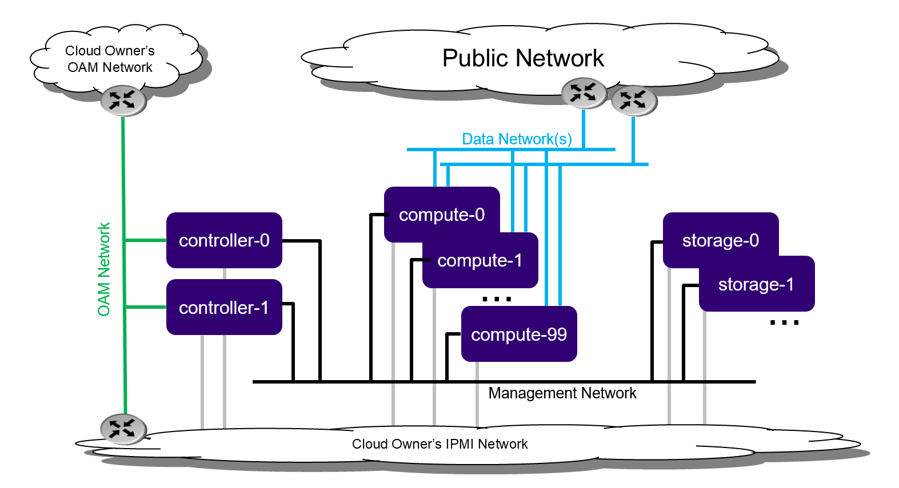

==============================================
Dedicated storage deployment guide stx.2019.05
==============================================

.. contents::
   :local:
   :depth: 1

**NOTE:**  The instructions to set up a StarlingX Cloud with Dedicated
Storage with containerized openstack services in this guide
are under development.
For approved instructions, see the
`StarlingX Cloud with Dedicated Storage wiki page <https://wiki.openstack.org/wiki/StarlingX/Containers/InstallationOnStandardStorage>`__.

----------------------
Deployment description
----------------------

Cloud with Dedicated Storage is the standard StarlingX deployment option with
independent controller, compute, and storage nodes.

This deployment option provides the maximum capacity for a single region
deployment, with a supported growth path to a multi-region deployment option by
adding a secondary region.

   *Dedicated Storage deployment configuration*

Cloud with Dedicated Storage includes:

- 2x node HA controller cluster with HA services running across the controller
  nodes in either active/active or active/standby mode.
- Pool of up to 100 compute nodes for hosting virtual machines and virtual
  networks.
- 2-9x node HA CEPH storage cluster for hosting virtual volumes, images, and
  object storage that supports a replication factor of two or three.

  Storage nodes are deployed in replication groups of two or three. Replication
  of objects is done strictly within the replication group.

  Supports up to four groups of 2x storage nodes, or up to three groups of 3x storage
  nodes.

-----------------------------------
Preparing dedicated storage servers
-----------------------------------

**********
Bare metal
**********

Required Servers:

-  Controllers: 2
-  Storage

   -  Replication factor of 2: 2 - 8
   -  Replication factor of 3: 3 - 9

-  Computes: 2 - 100

^^^^^^^^^^^^^^^^^^^^^
Hardware requirements
^^^^^^^^^^^^^^^^^^^^^

The recommended minimum requirements for the physical servers where
Dedicated Storage is deployed include:

-  Minimum processor:

   -  Dual-CPU Intel® Xeon® E5 26xx family (SandyBridge) 8 cores/socket

-  Memory:

   -  64 GB controller, storage
   -  32 GB compute

-  BIOS:

   -  Hyper-Threading technology: Enabled
   -  Virtualization technology: Enabled
   -  VT for directed I/O: Enabled
   -  CPU power and performance policy: Performance
   -  CPU C state control: Disabled
   -  Plug & play BMC detection: Disabled

-  Primary disk:

   -  500 GB SDD or NVMe controller
   -  120 GB (min. 10K RPM) compute and storage

-  Additional disks:

   -  One or more 500 GB disks (min. 10K RPM) storage, compute

-  Network ports\*

   -  Management: 10GE controller, storage, compute
   -  OAM: 10GE controller
   -  Data: n x 10GE compute

*******************
Virtual environment
*******************

Run the libvirt QEMU setup scripts to set up virtualized OAM and
management networks:

::

   $ bash setup_network.sh

Building XML for definition of virtual servers:

::

   $ bash setup_configuration.sh -c dedicatedstorage -i <starlingx iso image>

The default XML server definitions that are created by the previous script
are as follows:

- dedicatedstorage-controller-0
- dedicatedstorage-controller-1
- dedicatedstorage-compute-0
- dedicatedstorage-compute-1
- dedicatedstorage-storage-0
- dedicatedstorage-storage-1

^^^^^^^^^^^^^^^^^^^^^^^^^
Power up a virtual server
^^^^^^^^^^^^^^^^^^^^^^^^^

To power up a virtual server, run the following command:

::

    $ sudo virsh start <server-xml-name>

Here is an example:

::

    $ sudo virsh start dedicatedstorage-controller-0

^^^^^^^^^^^^^^^^^^^^^^^^^^^^^^
Access virtual server consoles
^^^^^^^^^^^^^^^^^^^^^^^^^^^^^^

The XML for virtual servers in stx-tools repo, deployment/libvirt,
provides both graphical and text consoles.
Follow these steps to access a virtual server console:

#. Access the graphical console in virt-manager by right-clicking on the
   domain (i.e. the server) and selecting "Open".

#. Access the textual console using the command "virsh console $DOMAIN",
   where DOMAIN is the name of the server shown in virsh.

#. When booting controller-0 for the first time, both the serial and
   graphical consoles present the initial configuration menu for the
   cluster. You can select the serial or graphical console for controller-0.
   However, for the other nodes, you can only use the serial console
   regardless of the selected option.

#. Open the graphic console on all servers before powering them on to
   observe the boot device selection and PXI boot progress. Run the "virsh
   console $DOMAIN" command promptly after powering up to see the initial boot
   sequence that follows the boot device selection. Only a few seconds exist
   during which you can see the sequence.

--------------------------------
Installing the controller-0 host
--------------------------------

Installing controller-0 involves initializing a host with software and
then applying a bootstrap configuration from the command line. The
configured bootstrapped host becomes controller-0.

Following is the general procedure:

#. Be sure the StarlingX ISO is on a USB device and it is plugged into
   the USB port of the server that will be controller-0 and then
   power on the server.

#. Configure the controller using the config_controller script.

*************************
Initializing controller-0
*************************

This section describes how to initialize StarlingX in host controller-0.
Except where noted, you must execute all the commands from a console of
the host.

#. Be sure the StarlingX ISO is on a USB device and it is plugged into
   the USB port of the server that will be controller-0.

#. Power on the server.

#. Wait for the console to show the StarlingX ISO booting options:

   - **All-in-one Controller Configuration**

     - When the installer is loaded and the installer welcome screen
       appears in the controller-0 host, select "All-in-one Controller Configuration"
       for the type of installation.

   - **Graphical Console**

     - Select the "Graphical Console" as the console to use during
       installation.

   - **Standard Security Boot Profile**

     - Select "Standard Security Boot Profile" as the Security Profile.

#. Monitor the initialization. When the installation is complete, a reboot is initiated
   on the controller-0 host.  The GNU GRUB screen briefly displays and then
   boots automatically into the StarlingX image.

#. Log into controller-0 as user wrsroot and use wrsroot as the password. The
   first time you log in as wrsroot, you are required to change your
   password. Enter the current password (i.e. wrsroot):

   ::

      Changing password for wrsroot.
      (current) UNIX Password:

#. Enter a new password for the wrsroot account:

   ::

      New password:

#. Enter the new password again to confirm it:

   ::

      Retype new password:

#. The controller-0 is initialized with StarlingX and is ready for configuration.

************************
Configuring controller-0
************************

This section describes how to interactively configure controller-0
to bootstrap the system with minimal critical data.
Except where noted, you must execute all commands from the console
of the active controller (i.e. controller-0).

When run interactively, the config_controller script presents a series
of prompts for initial configuration of StarlingX:

-  For the virtual environment, you can accept all the default values
   immediately after "system date and time".
-  For a physical deployment, answer the bootstrap configuration
   questions with answers applicable to your particular physical setup.

The script configures the first controller in the StarlingX
cluster as controller-0. The prompts are grouped by configuration
area.

Follow this procedure to interactively configure controller-0:

#. Start the script with no parameters:

   ::

      controller-0:~$ sudo config_controller
      System Configuration
      ================
      Enter ! at any prompt to abort...
      ...

#. Accept all the default values immediately after "system date and time":

::

   ...
   Applying configuration (this will take several minutes):

   01/08: Creating bootstrap configuration ... DONE
   02/08: Applying bootstrap manifest ... DONE
   03/08: Persisting local configuration ... DONE
   04/08: Populating initial system inventory ... DONE
   05:08: Creating system configuration ... DONE
   06:08: Applying controller manifest ... DONE
   07:08: Finalize controller configuration ... DONE
   08:08: Waiting for service activation ... DONE

   Configuration was applied

   Please complete any out of service commissioning steps with system
   commands and unlock controller to proceed.

#. After config_controller bootstrap configuration, REST API, CLI and
   Horizon interfaces are enabled on the controller-0 OAM IP address. The
   remaining installation instructions use the CLI.

------------------------------------
Provisioning controller-0 and system
------------------------------------

On controller-0, acquire Keystone administrative privileges:

::

   controller-0:~$ source /etc/nova/openrc

*********************************************
Configuring provider networks at installation
*********************************************

You must set up provider networks at installation so that you can attach
data interfaces and unlock the compute nodes.

Set up one provider network of the vlan type and name it providernet-a:

::

   [wrsroot@controller-0 ~(keystone_admin)]$ neutron providernet-create providernet-a --type=vlan
   [wrsroot@controller-0 ~(keystone_admin)]$ neutron providernet-range-create --name providernet-a-range1 --range 100-400 providernet-a

*********************************************
Adding a Ceph storage backend at installation
*********************************************

Follow these steps:

#. Add CEPH Storage backend:

   ::

      [wrsroot@controller-0 ~(keystone_admin)]$ system storage-backend-add ceph -s cinder,glance,swift,nova

      WARNING : THIS OPERATION IS NOT REVERSIBLE AND CANNOT BE CANCELLED.

      By confirming this operation, Ceph backend will be created.
      A minimum of 2 storage nodes are required to complete the configuration.
      Set the 'confirmed' field to execute this operation for the ceph backend.

#. Confirm the operation:

   ::

      [wrsroot@controller-0 ~(keystone_admin)]$ system storage-backend-add ceph -s cinder,glance,swift,nova --confirmed

      System configuration has changed.
      Please follow the administrator guide to complete configuring the system.

      +--------------------------------------+------------+---------+-------------+--------------------+----------+...
      | uuid                                 | name       | backend | state       | task               | services |...
      +--------------------------------------+------------+---------+-------------+--------------------+----------+...
      | 48ddb10a-206c-42da-bb3f-f7160a356724 | ceph-store | ceph    | configuring | applying-manifests | cinder,  |...
      |                                      |            |         |             |                    | glance,  |...
      |                                      |            |         |             |                    | swift    |...
      |                                      |            |         |             |                    | nova     |...
      |                                      |            |         |             |                    |          |...
      | 55f49f86-3e01-4d03-a014-42e1b55ba487 | file-store | file    | configured  | None               | glance   |...
      +--------------------------------------+------------+---------+-------------+--------------------+----------+...

#. Confirm CEPH storage is configured:

   ::

      [wrsroot@controller-0 ~(keystone_admin)]$ system storage-backend-list
      +--------------------------------------+------------+---------+------------+-------------------+-----------+...
      | uuid                                 | name       | backend | state      | task              | services  |...
      +--------------------------------------+------------+---------+------------+-------------------+-----------+...
      | 48ddb10a-206c-42da-bb3f-f7160a356724 | ceph-store | ceph    | configured | provision-storage | cinder,   |...
      |                                      |            |         |            |                   | glance,   |...
      |                                      |            |         |            |                   | swift     |...
      |                                      |            |         |            |                   | nova      |...
      |                                      |            |         |            |                   |           |...
      | 55f49f86-3e01-4d03-a014-42e1b55ba487 | file-store | file    | configured | None              | glance    |...
      +--------------------------------------+------------+---------+------------+-------------------+-----------+...

**********************
Unlocking controller-0
**********************

You must unlock controller-0 so that you can use it to install the remaining
hosts. Use the system host-unlock command:

::

   [wrsroot@controller-0 ~(keystone_admin)]$ system host-unlock controller-0

The host reboots. During the reboot, the command line is
unavailable and any ssh connections are dropped. To monitor the
progress of the reboot, use the controller-0 console.

****************************************
Verifying the controller-0 configuration
****************************************

Follow these steps:

#. On controller-0, acquire Keystone administrative privileges:

   ::

      controller-0:~$ source /etc/nova/openrc

#. Verify StarlingX controller services are running:

   ::

      [wrsroot@controller-0 ~(keystone_admin)]$ system service-list
      +-----+-------------------------------+--------------+----------------+
      | id  | service_name                  | hostname     | state          |
      +-----+-------------------------------+--------------+----------------+
      ...
      | 1   | oam-ip                        | controller-0 | enabled-active |
      | 2   | management-ip                 | controller-0 | enabled-active |
      ...
      +-----+-------------------------------+--------------+----------------+

#. Verify that controller-0 is unlocked, enabled, and available:

   ::

      [wrsroot@controller-0 ~(keystone_admin)]$ system host-list
      +----+--------------+-------------+----------------+-------------+--------------+
      | id | hostname     | personality | administrative | operational | availability |
      +----+--------------+-------------+----------------+-------------+--------------+
      | 1  | controller-0 | controller  | unlocked       | enabled     | available    |
      +----+--------------+-------------+----------------+-------------+--------------+

*******************************
Provisioning filesystem storage
*******************************

Follow these steps:

#. List the controller file systems with status and current sizes:

   ::

      [wrsroot@controller-0 ~(keystone_admin)]$ system controllerfs-list
      +--------------------------------------+-----------------+------+--------------------+------------+-------+
      | UUID                                 | FS Name         | Size | Logical Volume     | Replicated | State |
      |                                      |                 | in   |                    |            |       |
      |                                      |                 | GiB  |                    |            |       |
      +--------------------------------------+-----------------+------+--------------------+------------+-------+
      | 4e31c4ea-6970-4fc6-80ba-431fdcdae15f | backup          | 5    | backup-lv          | False      | None  |
      | 6c689cd7-2bef-4755-a2fb-ddd9504692f3 | database        | 5    | pgsql-lv           | True       | None  |
      | 44c7d520-9dbe-41be-ac6a-5d02e3833fd5 | extension       | 1    | extension-lv       | True       | None  |
      | 809a5ed3-22c0-4385-9d1e-dd250f634a37 | glance          | 8    | cgcs-lv            | True       | None  |
      | 9c94ef09-c474-425c-a8ba-264e82d9467e | gnocchi         | 5    | gnocchi-lv         | False      | None  |
      | 895222b3-3ce5-486a-be79-9fe21b94c075 | img-conversions | 8    | img-conversions-lv | False      | None  |
      | 5811713f-def2-420b-9edf-6680446cd379 | scratch         | 8    | scratch-lv         | False      | None  |
      +--------------------------------------+-----------------+------+--------------------+------------+-------+

#. Modify filesystem sizes

   ::

      [wrsroot@controller-0 ~(keystone_admin)]$ system controllerfs-modify backup=42 database=12 img-conversions=12

-------------------------------------------------------
Installing controller-1 / storage hosts / compute hosts
-------------------------------------------------------

After initializing and configuring an active controller, you can add and
configure a backup controller as well as additional compute or storage hosts.
For each host do the following:

*********************
Initializing the host
*********************

Power on the Host. The following displays in the host's console:

::

   Waiting for this node to be configured.

   Please configure the personality for this node from the
   controller node in order to proceed.

**************************************
Updating the host name and personality
**************************************

Follow these steps:

#. On controller-0, acquire Keystone administrative privileges:

   ::

      controller-0:~$ source /etc/nova/openrc

#. Wait for controller-0 to discover the new host.
   List the host until a new UNKNOWN host appears in the table:

   ::

      [wrsroot@controller-0 ~(keystone_admin)]$ system host-list
      +----+--------------+-------------+----------------+-------------+--------------+
      | id | hostname     | personality | administrative | operational | availability |
      +----+--------------+-------------+----------------+-------------+--------------+
      | 1  | controller-0 | controller  | unlocked       | enabled     | available    |
      | 2  | None         | None        | locked         | disabled    | offline      |
      +----+--------------+-------------+----------------+-------------+--------------+

#. Use the system host-add command to update the host's personality attribute:

   ::

      [wrsroot@controller-0 ~(keystone_admin)]$ system host-add -n <controller_name> -p <personality> -m <mac address>

   **NOTE:** Use the Mac address for the specific network interface to
   which you connect (e.g. OAM network interface for controller-1
   node or management network interface for compute and storage nodes).

   You can check the **NIC** MAC address from "Virtual Manager GUI" under *"Show
   virtual hardware details -*\ **i**\ *" Main Banner --> NIC: --> specific
   "Bridge name:" under MAC address text field.*

*************
Monitor hosts
*************

On controller-0, you can monitor the installation progress by periodically
running the system host-show command for the host. Progress appears
in the install_state field.

::

   [wrsroot@controller-0 ~(keystone_admin)]$ system host-show <host> | grep install
   | install_output      | text                                 |
   | install_state       | booting                              |
   | install_state_info  | None                                 |

Wait while the host is configured and rebooted. Depending on hardware,
a reboot can take up to 20 minutes. When the reboot completes,
the host is reported as locked, disabled, and online.

**********
List hosts
**********

You can use the system host-list command to list the hosts
once the nodes have been installed, configured and rebooted, on
controller-0:

::

   [wrsroot@controller-0 ~(keystone_admin)]$ system host-list
   +----+--------------+-------------+----------------+-------------+--------------+
   | id | hostname     | personality | administrative | operational | availability |
   +----+--------------+-------------+----------------+-------------+--------------+
   | 1  | controller-0 | controller  | unlocked       | enabled     | available    |
   | 2  | controller-1 | controller  | locked         | disabled    | online       |
   | 3  | compute-0    | compute     | locked         | disabled    | online       |
   | 4  | compute-1    | compute     | locked         | disabled    | online       |
   | 5  | storage-0    | storage     | locked         | disabled    | online       |
   | 6  | storage-1    | storage     | locked         | disabled    | online       |
   +----+--------------+-------------+----------------+-------------+--------------+

-------------------------
Provisioning controller-1
-------------------------

On controller-0, list the hosts:

::

   [wrsroot@controller-0 ~(keystone_admin)]$ system host-list
   +----+--------------+-------------+----------------+-------------+--------------+
   | id | hostname     | personality | administrative | operational | availability |
   +----+--------------+-------------+----------------+-------------+--------------+
   ...
   | 2  | controller-1 | controller  | locked         | disabled    | online       |
   ...
   +----+--------------+-------------+----------------+-------------+--------------+

***********************************************
Provisioning network interfaces on controller-1
***********************************************

Follow these steps:

#. Use the system host-port-list command to list hardware port names, types,
and PCI addresses that have been discovered:

   ::

      [wrsroot@controller-0 ~(keystone_admin)]$ system host-port-list controller-1

#. Provision the OAM interface for controller-1:

   ::

      [wrsroot@controller-0 ~(keystone_admin)]$ system host-if-modify -n <oam interface> -c platform --networks oam controller-1 <oam interface>

**********************
Unlocking controller-1
**********************

Follow these steps:

#. Unlock controller-1:

   ::

      [wrsroot@controller-0 ~(keystone_admin)]$ system host-unlock controller-1

#. Wait for controller-1 to reboot. Depending on hardware, it can
   take up to 10 minutes for the reboot to complete.

   **NOTE:** Controller-1 remains in a degraded state until
   data synchronization is complete. The length of time controller-1
   remains in this state depends on the virtualization host's configuration
   (i.e. the number and configuration of physical disks used to host
   the nodes' virtual disks. Also, the management network is expected
   to have a link capacity of 10000.  Link capacity of 1000 is not
   supported due to excessive data synchronization time. Use 'fm alarm-list' to
   confirm status.

   ::

      [wrsroot@controller-0 ~(keystone_admin)]$ system host-list
      +----+--------------+-------------+----------------+-------------+--------------+
      | id | hostname     | personality | administrative | operational | availability |
      +----+--------------+-------------+----------------+-------------+--------------+
      | 1  | controller-0 | controller  | unlocked       | enabled     | available    |
      | 2  | controller-1 | controller  | unlocked       | enabled     | available    |
      ...

-------------------------
Provisioning storage host
-------------------------

**************************************
Provisioning storage on a storage host
**************************************

Follow these steps:

#. List the available physical disks in storage-N:

   ::

      [wrsroot@controller-0 ~(keystone_admin)]$ system host-disk-list storage-0
      +--------------------------------------+-----------+---------+---------+-------+------------+--------------+...
      | uuid                                 | device_no | device_ | device_ | size_ | available_ | rpm          |...
      |                                      | de        | num     | type    | gib   | gib        |              |...
      +--------------------------------------+-----------+---------+---------+-------+------------+--------------+...
      | a2bbfe1f-cf91-4d39-a2e8-a9785448aa56 | /dev/sda  | 2048    | HDD     | 292.  | 0.0        | Undetermined |...
      |                                      |           |         |         | 968   |            |              |...
      |                                      |           |         |         |       |            |              |...
      | c7cc08e6-ff18-4229-a79d-a04187de7b8d | /dev/sdb  | 2064    | HDD     | 100.0 | 99.997     | Undetermined |...
      |                                      |           |         |         |       |            |              |...
      |                                      |           |         |         |       |            |              |...
      | 1ece5d1b-5dcf-4e3c-9d10-ea83a19dd661 | /dev/sdc  | 2080    | HDD     | 4.0   | 3.997      |...
      |                                      |           |         |         |       |            |              |...
      |                                      |           |         |         |       |            |              |...
      +--------------------------------------+-----------+---------+---------+-------+------------+--------------+...

#. List the available storage tiers in storage-N:

   ::

      [wrsroot@controller-0 ~(keystone_admin)]$ system storage-tier-list ceph_cluster
      +--------------------------------------+---------+--------+--------------------------------------+
      | uuid                                 | name    | status | backend_using                        |
      +--------------------------------------+---------+--------+--------------------------------------+
      | 4398d910-75e4-4e99-a57f-fc147fb87bdb | storage | in-use | 5131a848-25ea-4cd8-bbce-0d65c84183df |
      +--------------------------------------+---------+--------+--------------------------------------+

#. Create a storage function (i.e. OSD) in storage-N. At least two unlocked and
   enabled hosts with monitors are required. Candidates are controller-0,
   controller-1, and storage-0.

   ::

      [wrsroot@controller-0 ~(keystone_admin)]$ system host-stor-add storage-0 c7cc08e6-ff18-4229-a79d-a04187de7b8d
      +------------------+--------------------------------------------------+
      | Property         | Value                                            |
      +------------------+--------------------------------------------------+
      | osdid            | 0                                                |
      | function         | osd                                              |
      | journal_location | 34989bad-67fc-49ea-9e9c-38ca4be95fad             |
      | journal_size_gib | 1024                                             |
      | journal_path     | /dev/disk/by-path/pci-0000:00:0d.0-ata-2.0-part2 |
      | journal_node     | /dev/sdb2                                        |
      | uuid             | 34989bad-67fc-49ea-9e9c-38ca4be95fad             |
      | ihost_uuid       | 4a5ed4fc-1d2b-4607-acf9-e50a3759c994             |
      | idisk_uuid       | c7cc08e6-ff18-4229-a79d-a04187de7b8d             |
      | tier_uuid        | 4398d910-75e4-4e99-a57f-fc147fb87bdb             |
      | tier_name        | storage                                          |
      | created_at       | 2018-08-16T00:39:44.409448+00:00                 |
      | updated_at       | 2018-08-16T00:40:07.626762+00:00                 |
      +------------------+--------------------------------------------------+

#. Create the remaining available storage function (an OSD) in storage-N
   based on the number of available physical disks.
   Start by listing the OSDs:

   ::

      [wrsroot@controller-0 ~(keystone_admin)]$ system host-stor-list storage-0
      +--------------------------------------+----------+-------+--------------+--------------------------------------+
      | uuid                                 | function | osdid | capabilities | idisk_uuid                           |
      +--------------------------------------+----------+-------+--------------+--------------------------------------+
      | 34989bad-67fc-49ea-9e9c-38ca4be95fad | osd      | 0     | {}           | c7cc08e6-ff18-4229-a79d-a04187de7b8d |
      +--------------------------------------+----------+-------+--------------+--------------------------------------+

#. Unlock storage-N:

   ::

      [wrsroot@controller-0 ~(keystone_admin)]$ system host-unlock storage-0

   **NOTE:** Before you continue, repeat Provisioning Storage steps on
   remaining storage nodes.

---------------------------
Provisioning a compute host
---------------------------

You must configure the network interfaces and the storage disks on a
host before you can unlock it. For each compute host, do the following:

On controller-0, acquire Keystone administrative privileges:

::

   controller-0:~$ source /etc/nova/openrc

*************************************************
Provisioning network interfaces on a compute host
*************************************************

Follow these steps:

#. In order to identify hardware port names, types, and discovered
   pci-addresses on controller-0, list the host ports:

   -  **Only in virtual environment**: Ensure that the interface used is
      one of those attached to the host bridge with model type "virtio" (i.e.
      eth1000 and eth1001). The model type "e1000" emulated devices will
      not work for provider networks:

   ::

      [wrsroot@controller-0 ~(keystone_admin)]$ system host-port-list compute-0

#. Use the following command to provision the data interface for compute:

   ::

      [wrsroot@controller-0 ~(keystone_admin)]$ system host-if-modify -p providernet-a -c data compute-0 eth1000

***************************
VSwitch virtual environment
***************************

**Only in virtual environment**. If the compute node has more than four CPUs,
the system auto-configures the vswitch to use two cores. However, some virtual
environments do not properly support multi-queue, which is required in a
multi-CPU environment. Therefore, run the following command to reduce the
vswitch cores to one:

::

   [wrsroot@controller-0 ~(keystone_admin)]$ system host-cpu-modify compute-0 -f vswitch -p0 1
   +--------------------------------------+-------+-----------+-------+--------+...
   | uuid                                 | log_c | processor | phy_c | thread |...
   |                                      | ore   |           | ore   |        |...
   +--------------------------------------+-------+-----------+-------+--------+...
   | a3b5620c-28b1-4fe0-9e97-82950d8582c2 | 0     | 0         | 0     | 0      |...
   | f2e91c2b-bfc5-4f2a-9434-bceb7e5722c3 | 1     | 0         | 1     | 0      |...
   | 18a98743-fdc4-4c0c-990f-3c1cb2df8cb3 | 2     | 0         | 2     | 0      |...
   | 690d25d2-4f99-4ba1-a9ba-0484eec21cc7 | 3     | 0         | 3     | 0      |...
   +--------------------------------------+-------+-----------+-------+--------+...

**************************************
Provisioning storage on a compute host
**************************************

Follow these steps:

#. Review the available disk space and capacity and then obtain the uuid(s) of
   the physical disk(s) to be used for nova local:

   ::

      [wrsroot@controller-0 ~(keystone_admin)]$ system host-disk-list compute-0
      +--------------------------------------+-----------+---------+---------+-------+------------+...
      | uuid                                 | device_no | device_ | device_ | size_ | available_ |...
      |                                      | de        | num     | type    | gib   | gib        |...
      +--------------------------------------+-----------+---------+---------+-------+------------+
      | 14e52a55-f6a7-40ad-a0b1-11c2c3b6e7e9 | /dev/sda  | 2048    | HDD     | 292.  | 265.132    |...
      | a639914b-23a9-4071-9f25-a5f1960846cc | /dev/sdb  | 2064    | HDD     | 100.0 | 99.997     |...
      +--------------------------------------+-----------+---------+---------+-------+------------+...

#. Use the following command to create the 'nova-local' local volume group:

   ::

      [wrsroot@controller-0 ~(keystone_admin)]$ system host-lvg-add compute-0 nova-local
      +-----------------+-------------------------------------------------------------------+
      | Property        | Value                                                             |
      +-----------------+-------------------------------------------------------------------+
      | lvm_vg_name     | nova-local                                                        |
      | vg_state        | adding                                                            |
      | uuid            | 37f4c178-f0fe-422d-b66e-24ae057da674                              |
      | ihost_uuid      | f56921a6-8784-45ac-bd72-c0372cd95964                              |
      | lvm_vg_access   | None                                                              |
      | lvm_max_lv      | 0                                                                 |
      | lvm_cur_lv      | 0                                                                 |
      | lvm_max_pv      | 0                                                                 |
      | lvm_cur_pv      | 0                                                                 |
      | lvm_vg_size_gib | 0.00                                                              |
      | lvm_vg_total_pe | 0                                                                 |
      | lvm_vg_free_pe  | 0                                                                 |
      | created_at      | 2018-08-16T00:57:46.340454+00:00                                  |
      | updated_at      | None                                                              |
      | parameters      | {u'concurrent_disk_operations': 2, u'instance_backing': u'image'} |
      +-----------------+-------------------------------------------------------------------+

#. Use the following command to create a disk partition to add to the volume
   group based on the uuid of the physical disk:

   ::

      [wrsroot@controller-0 ~(keystone_admin)]$ system host-pv-add compute-0 nova-local a639914b-23a9-4071-9f25-a5f1960846cc
      +--------------------------+--------------------------------------------+
      | Property                 | Value                                      |
      +--------------------------+--------------------------------------------+
      | uuid                     | 56fdb63a-1078-4394-b1ce-9a0b3bff46dc       |
      | pv_state                 | adding                                     |
      | pv_type                  | disk                                       |
      | disk_or_part_uuid        | a639914b-23a9-4071-9f25-a5f1960846cc       |
      | disk_or_part_device_node | /dev/sdb                                   |
      | disk_or_part_device_path | /dev/disk/by-path/pci-0000:00:0d.0-ata-2.0 |
      | lvm_pv_name              | /dev/sdb                                   |
      | lvm_vg_name              | nova-local                                 |
      | lvm_pv_uuid              | None                                       |
      | lvm_pv_size_gib          | 0.0                                        |
      | lvm_pe_total             | 0                                          |
      | lvm_pe_alloced           | 0                                          |
      | ihost_uuid               | f56921a6-8784-45ac-bd72-c0372cd95964       |
      | created_at               | 2018-08-16T01:05:59.013257+00:00           |
      | updated_at               | None                                       |
      +--------------------------+--------------------------------------------+

#. Remote RAW Ceph storage that is backed up is used to back up the nova local ephemeral
   volumes:

   ::

      [wrsroot@controller-0 ~(keystone_admin)]$ system host-lvg-modify -b remote compute-0 nova-local

************************
Unlocking a compute host
************************

On controller-0, use the system host-unlock command to unlock the
compute-N:

::

   [wrsroot@controller-0 ~(keystone_admin)]$ system host-unlock compute-0

Wait while the compute-N is rebooted. It might take up to 10 minutes
for the reboot to complete depending on the hardware.
Once compute-N reboots, its availability state becomes "in-test", which is
followed by "unlocked/enabled".

-------------------
System health check
-------------------

***********************
Listing StarlingX nodes
***********************

On controller-0, use the system host-list command to view the nodes.
Eventually, all nodes are reported as unlocked, enabled, and available:

::

   [wrsroot@controller-0 ~(keystone_admin)]$ system host-list
   +----+--------------+-------------+----------------+-------------+--------------+
   | id | hostname     | personality | administrative | operational | availability |
   +----+--------------+-------------+----------------+-------------+--------------+
   | 1  | controller-0 | controller  | unlocked       | enabled     | available    |
   | 2  | controller-1 | controller  | unlocked       | enabled     | available    |
   | 3  | compute-0    | compute     | unlocked       | enabled     | available    |
   | 4  | compute-1    | compute     | unlocked       | enabled     | available    |
   | 5  | storage-0    | storage     | unlocked       | enabled     | available    |
   | 6  | storage-1    | storage     | unlocked       | enabled     | available    |
   +----+--------------+-------------+----------------+-------------+--------------+

******************************
Checking StarlingX CEPH health
******************************

Use the following command to check the CEPH health:

::

   [wrsroot@controller-0 ~(keystone_admin)]$ ceph -s
       cluster e14ebfd6-5030-4592-91c3-7e6146b3c910
        health HEALTH_OK
        monmap e1: 3 mons at {controller-0=192.168.204.3:6789/0,controller-1=192.168.204.4:6789/0,storage-0=192.168.204.204:6789/0}
               election epoch 22, quorum 0,1,2 controller-0,controller-1,storage-0
        osdmap e84: 2 osds: 2 up, 2 in
               flags sortbitwise,require_jewel_osds
         pgmap v168: 1600 pgs, 5 pools, 0 bytes data, 0 objects
               87444 kB used, 197 GB / 197 GB avail
                   1600 active+clean
   controller-0:~$

*****************
System alarm list
*****************

When all nodes are unlocked, enabled, and available, check 'fm alarm-list' for
issues.

Your StarlingX deployment is now up and running with 2x HA controllers with
Cinder storage, 1x compute, 3x storages and all OpenStack services up and
running. You can now proceed with standard OpenStack APIs, CLIs and/or Horizon
to load Glance images, configure Nova Flavors, configure Neutron networks, and
launch Nova virtual machines.

----------------------
Deployment terminology
----------------------

.. include:: deployment_terminology.rst
   :start-after: incl-standard-controller-deployment-terminology:
   :end-before: incl-standard-controller-deployment-terminology-end:

.. include:: deployment_terminology.rst
   :start-after: incl-dedicated-storage-deployment-terminology:
   :end-before: incl-dedicated-storage-deployment-terminology-end:

.. include:: deployment_terminology.rst
   :start-after: incl-common-deployment-terminology:
   :end-before: incl-common-deployment-terminology-end:
