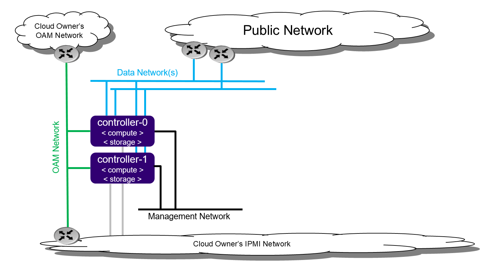
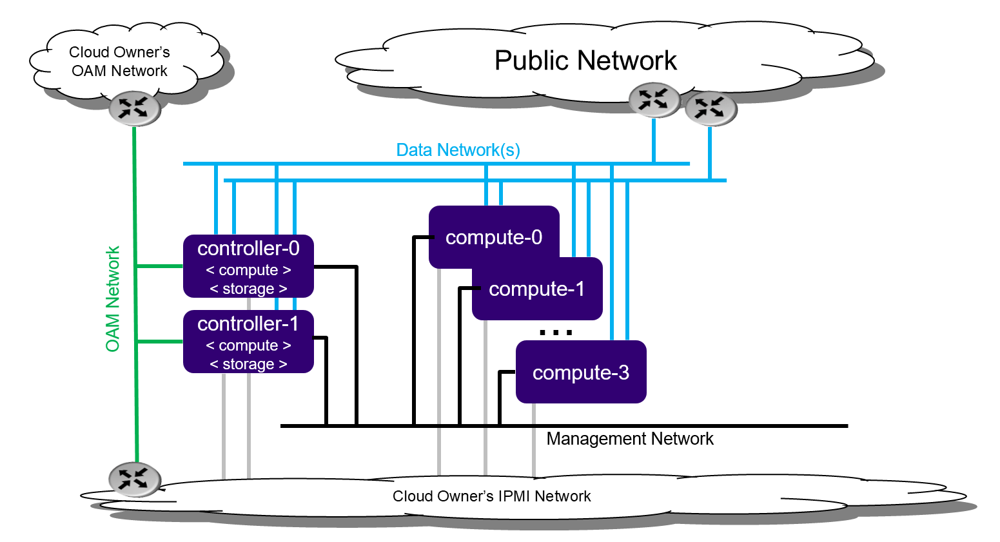

==============================================
All-In-One Duplex deployment guide stx.2019.05
==============================================

.. contents::
   :local:
   :depth: 1

**NOTE:**  The instructions to setup a StarlingX All-in-One Duplex
(AIO-DX) with containerized openstack services in this guide
are under development.
For approved instructions, see the
`All in One Duplex Configuration wiki page <https://wiki.openstack.org/wiki/StarlingX/Containers/InstallationOnAIODX>`__.

----------------------
Deployment description
----------------------

*****************
All-In-One Duplex
*****************

The All-In-One Duplex (AIO-DX) deployment option provides all three cloud
functions (controller, compute, and storage) on two physical servers. With cloud
technologies, multiple diverse application types can be deployed and
consolidated onto a protected pair of physical servers. For example:

- Consolidate legacy applications that must run standalone on a server by
  using multiple virtual machines.
- Consolidate legacy applications that run on different operating systems
  or different distributions of operating systems by using multiple virtual
  machines.

   *All-In-One Duplex deployment configuration*

This two node cluster enables the following:

- High availability services running on the controller function across the
  two physical servers in either active/active or active/standby mode.
- Storage function running on top of LVM on single second disk, DRBD-sync'd
  between the servers.
- Virtual machines being scheduled on both compute functions.

An All-In-One Duplex deployment provides protection against overall server
hardware fault. Should an overall server hardware fault occur:

- All controller high availability services go active on remaining
  healthy server.
- All virtual machines are recovered on the remaining healthy server.

The All-In-One Duplex deployment solution is required for a variety of special
case situations.
Here are two examples:

- Small amount of cloud processing/storage.
- Protection against overall server hardware faults.

**************************
All-In-One Duplex extended
**************************

The All-In-One Duplex Extended deployment option extends the capacity of the
All-In-One Duplex deployment by adding up to four compute nodes to the
deployment. The extended deployment option provides a capacity growth path for
someone starting with an All-In-One Duplex deployment.

With this option, virtual machines can be scheduled on either of the
all-in-one controller nodes and/or the compute nodes.

   *All-In-One Duplex Extended deployment configuration*

This configuration is limited to four compute nodes as the controller function
on the all-in-one controllers has only a portion of the processing power of the
overall server.

-----------------------------------
Preparing All-In-One Duplex servers
-----------------------------------

**********
Bare metal
**********

Required Servers:

-  Combined servers (controller + compute): 2

^^^^^^^^^^^^^^^^^^^^^
Hardware requirements
^^^^^^^^^^^^^^^^^^^^^

The recommended minimum requirements for the physical servers where
All-In-One Duplex is deployed include the following:

-  Minimum processor:

   -  Typical hardware form factor:

      - Dual-CPU Intel® Xeon® E5 26xx family (SandyBridge) 8 cores/socket
   -  Low cost / low power hardware form factor

      - Single-CPU Intel Xeon D-15xx family, 8 cores

-  Memory: 64 GB
-  BIOS:

   -  Hyper-Threading technology: Enabled
   -  Virtualization technology: Enabled
   -  VT for directed I/O: Enabled
   -  CPU power and performance policy: Performance
   -  CPU C state control: Disabled
   -  Plug & play BMC detection: Disabled

-  Primary disk:

   -  500 GB SDD or NVMe

-  Additional disks:

   -  Zero or more 500 GB disks (min. 10K RPM)

-  Network ports:

   **NOTE:** The All-In-One Duplex configuration requires one or more data ports.

   -  Management: 10GE
   -  OAM: 10GE
   -  Data: n x 10GE

*******************
Virtual environment
*******************

Run the libvirt QEMU setup scripts to set up virtualized OAM and
management networks:

::

   $ bash setup_network.sh

Building XML for definition of virtual servers:

::

   $ bash setup_configuration.sh -c duplex -i <starlingx iso image>

The default XML server definitions that are created by the previous script
are:

- duplex-controller-0
- duplex-controller-1

^^^^^^^^^^^^^^^^^^^^^^^^^
Power up a virtual server
^^^^^^^^^^^^^^^^^^^^^^^^^

To power up a virtual server, run the following command:

::

    $ sudo virsh start <server-xml-name>

Here is an example:

::

    $ sudo virsh start duplex-controller-0

^^^^^^^^^^^^^^^^^^^^^^^^^^^^^^
Access virtual server consoles
^^^^^^^^^^^^^^^^^^^^^^^^^^^^^^

The XML for virtual servers in stx-tools repo, deployment/libvirt,
provides both graphical and text consoles.
Follow these steps to access virtual server consoles:

#. Access the graphical console in virt-manager by right-clicking on the
   domain (i.e. the server) and selecting "Open".

#. Access the textual console using the command "virsh console $DOMAIN",
   where DOMAIN is the name of the server shown in virsh.

#. When booting the controller-0 for the first time, both the serial and
   graphical consoles present the initial configuration menu for the
   cluster. You can select the serial or graphical console for controller-0.
   However, for the other nodes, you can only use the serial console
   regardless of the selected option.

#. Open the graphic console on all servers before powering them on to
   observe the boot device selection and PXI boot progress. Run the "virsh
   console $DOMAIN" command promptly after powering up to see the initial boot
   sequence that follows the boot device selection. Only a few seconds exist
   during which you can see the sequence.

--------------------------------
Installing the controller-0 host
--------------------------------

Installing controller-0 involves initializing a host with software and
then applying a bootstrap configuration from the command line. The
configured bootstrapped host becomes controller-0.

Following is the general procedure:

#. Be sure the StarlingX ISO is on a USB device and it is plugged into
   the USB port of the server that will be controller-0 and then
   power on the server.

#. Configure the controller using the config_controller script.

*************************
Initializing controller-0
*************************

This section describes how to initialize StarlingX in host controller-0.
Except where noted, all the commands must be executed from a console of
the host.

#. Be sure the StarlingX ISO is on a USB device and it is plugged into
   the USB port of the server that will be controller-0.

#. Power on the server.

#. Wait for the console to show the StarlingX ISO booting options:

   - **All-in-one Controller Configuration**

     - When the installer is loaded and the installer welcome screen
       appears in the controller-0 host, select "All-in-one Controller Configuration"
       for the type of installation.

   - **Graphical Console**

     - Select the "Graphical Console" as the console to use during
       installation.

   - **Standard Security Boot Profile**

     - Select "Standard Security Boot Profile" as the Security Profile.

#. Monitor the initialization. When the installation is complete, a reboot is initiated
   on the controller-0 host.  The GNU GRUB screen briefly displays and then
   boots automatically into the StarlingX image.

#. Log into controller-0 as user wrsroot and use wrsroot as the password. The
   first time you log in as wrsroot, you are required to change your
   password. Enter the current password (i.e. wrsroot):

   ::

      Changing password for wrsroot.
      (current) UNIX Password:

#. Enter a new password for the wrsroot account:

   ::

      New password:

#. Enter the new password again to confirm it:

   ::

      Retype new password:

#. The controller-0 is initialized with StarlingX and is ready for configuration.

************************
Configuring controller-0
************************

This section describes how to interactively configure controller-0
to bootstrap the system with minimal critical data.
Except where noted, you must execute all commands from the console
of the active controller (i.e. controller-0).

When run interactively, the config_controller script presents a series
of prompts for initial configuration of StarlingX:

-  For the virtual environment, you can accept all the default values
   immediately after "system date and time".
-  For a physical deployment, answer the bootstrap configuration
   questions with answers applicable to your particular physical setup.

The script configures the first controller in the StarlingX
cluster as controller-0. The prompts are grouped by configuration
area.

Follow this procedure to interactively configure controller-0:

#. Start the script with no parameters:

   ::

      controller-0:~$ sudo config_controller
      System Configuration
      ================
      Enter ! at any prompt to abort...
      ...

#. Select [y] for System date and time:

   ::

      System date and time:
      -----------------------------

      Is the current date and time correct?  [y/N]: y

#. For System mode choose "duplex":

   ::

      System mode. Available options are:

      1) duplex-direct: two node-redundant configuration. Management and
      infrastructure networks are directly connected to peer ports
      2) duplex - two node redundant configuration
      3) simplex - single node non-redundant configuration
      System mode [duplex-direct]: 2

#. After System date and time and System mode:

   ::

      Applying configuration (this will take several minutes):

      01/08: Creating bootstrap configuration ... DONE
      02/08: Applying bootstrap manifest ... DONE
      03/08: Persisting local configuration ... DONE
      04/08: Populating initial system inventory ... DONE
      05:08: Creating system configuration ... DONE
      06:08: Applying controller manifest ... DONE
      07:08: Finalize controller configuration ... DONE
      08:08: Waiting for service activation ... DONE

      Configuration was applied

      Please complete any out of service commissioning steps with system commands and unlock controller to proceed.

#. After config_controller bootstrap configuration, REST API, CLI and
   Horizon interfaces are enabled on the controller-0 OAM IP address. The
   remaining installation instructions use the CLI.

----------------------------------
Provisioning the controller-0 host
----------------------------------

On controller-0, acquire Keystone administrative privileges:

::

   controller-0:~$ source /etc/nova/openrc

*********************************************
Configuring provider networks at installation
*********************************************

Set up one provider network of the vlan type and name it providernet-a:

::

   [wrsroot@controller-0 ~(keystone_admin)]$ neutron providernet-create providernet-a --type=vlan
   [wrsroot@controller-0 ~(keystone_admin)]$ neutron providernet-range-create --name providernet-a-range1 --range 100-400 providernet-a

*****************************************
Providing data interfaces on controller-0
*****************************************

Follow these steps:

#. List all interfaces:

   ::

      [wrsroot@controller-0 ~(keystone_admin)]$ system host-if-list -a controller-0
      +--------------------------------------+---------+----------+...+------+--------------+------+---------+------------+..
      | uuid                                 | name    | class    |...| vlan | ports        | uses | used by | attributes |..
      |                                      |         |          |...| id   |              | i/f  | i/f     |            |..
      +--------------------------------------+---------+----------+...+------+--------------+------+---------+------------+..
      | 49fd8938-e76f-49f1-879e-83c431a9f1af | enp0s3  | platform |...| None | [u'enp0s3']  | []   | []      | MTU=1500   |..
      | 8957bb2c-fec3-4e5d-b4ed-78071f9f781c | eth1000 | None     |...| None | [u'eth1000'] | []   | []      | MTU=1500   |..
      | bf6f4cad-1022-4dd7-962b-4d7c47d16d54 | eth1001 | None     |...| None | [u'eth1001'] | []   | []      | MTU=1500   |..
      | f59b9469-7702-4b46-bad5-683b95f0a1cb | enp0s8  | platform |...| None | [u'enp0s8']  | []   | []      | MTU=1500   |..
      +--------------------------------------+---------+----------+...+------+--------------+------+---------+------------+..

#. Configure the data interfaces:

   ::

      [wrsroot@controller-0 ~(keystone_admin)]$ system host-if-modify -c data controller-0 eth1000 -p providernet-a
      +------------------+--------------------------------------+
      | Property         | Value                                |
      +------------------+--------------------------------------+
      | ifname           | eth1000                              |
      | iftype           | ethernet                             |
      | ports            | [u'eth1000']                         |
      | providernetworks | providernet-a                        |
      | imac             | 08:00:27:c4:ad:3e                    |
      | imtu             | 1500                                 |
      | ifclass          | data                                 |
      | aemode           | None                                 |
      | schedpolicy      | None                                 |
      | txhashpolicy     | None                                 |
      | uuid             | 8957bb2c-fec3-4e5d-b4ed-78071f9f781c |
      | ihost_uuid       | 9c332b27-6f22-433b-bf51-396371ac4608 |
      | vlan_id          | None                                 |
      | uses             | []                                   |
      | used_by          | []                                   |
      | created_at       | 2018-08-28T12:50:51.820151+00:00     |
      | updated_at       | 2018-08-28T14:46:18.333109+00:00     |
      | sriov_numvfs     | 0                                    |
      | ipv4_mode        | disabled                             |
      | ipv6_mode        | disabled                             |
      | accelerated      | [True]                               |
      +------------------+--------------------------------------+

*************************************
Configuring Cinder on controller disk
*************************************

Follow these steps:

#. Review the available disk space and capacity and obtain the uuid of the
   physical disk:

   ::

      [wrsroot@controller-0 ~(keystone_admin)]$ system host-disk-list controller-0
      +--------------------------------------+-----------+---------+---------+---------+------------+...
      | uuid                                 | device_no | device_ | device_ | size_mi | available_ |...
      |                                      | de        | num     | type    | b       | mib        |...
      +--------------------------------------+-----------+---------+---------+---------+------------+...
      | 6b42c9dc-f7c0-42f1-a410-6576f5f069f1 | /dev/sda  | 2048    | HDD     | 600000  | 434072     |...
      |                                      |           |         |         |         |            |...
      |                                      |           |         |         |         |            |...
      | 534352d8-fec2-4ca5-bda7-0e0abe5a8e17 | /dev/sdb  | 2064    | HDD     | 16240   | 16237      |...
      |                                      |           |         |         |         |            |...
      |                                      |           |         |         |         |            |...
      | 146195b2-f3d7-42f9-935d-057a53736929 | /dev/sdc  | 2080    | HDD     | 16240   | 16237      |...
      |                                      |           |         |         |         |            |...
      |                                      |           |         |         |         |            |...
      +--------------------------------------+-----------+---------+---------+---------+------------+...

#. Create the 'cinder-volumes' local volume group:

   ::

      [wrsroot@controller-0 ~(keystone_admin)]$ system host-lvg-add controller-0 cinder-volumes
      +-----------------+--------------------------------------+
      | lvm_vg_name     | cinder-volumes                       |
      | vg_state        | adding                               |
      | uuid            | 61cb5cd2-171e-4ef7-8228-915d3560cdc3 |
      | ihost_uuid      | 9c332b27-6f22-433b-bf51-396371ac4608 |
      | lvm_vg_access   | None                                 |
      | lvm_max_lv      | 0                                    |
      | lvm_cur_lv      | 0                                    |
      | lvm_max_pv      | 0                                    |
      | lvm_cur_pv      | 0                                    |
      | lvm_vg_size     | 0.00                                 |
      | lvm_vg_total_pe | 0                                    |
      | lvm_vg_free_pe  | 0                                    |
      | created_at      | 2018-08-28T13:45:20.218905+00:00     |
      | updated_at      | None                                 |
      | parameters      | {u'lvm_type': u'thin'}               |
      +-----------------+--------------------------------------+

#. Create a disk partition to add to the volume group:

   ::

      [wrsroot@controller-0 ~(keystone_admin)]$ system host-disk-partition-add controller-0 534352d8-fec2-4ca5-bda7-0e0abe5a8e17 16237 -t lvm_phys_vol
      +-------------+--------------------------------------------------+
      | Property    | Value                                            |
      +-------------+--------------------------------------------------+
      | device_path | /dev/disk/by-path/pci-0000:00:0d.0-ata-2.0-part1 |
      | device_node | /dev/sdb1                                        |
      | type_guid   | ba5eba11-0000-1111-2222-000000000001             |
      | type_name   | None                                             |
      | start_mib   | None                                             |
      | end_mib     | None                                             |
      | size_mib    | 16237                                            |
      | uuid        | 0494615f-bd79-4490-84b9-dcebbe5f377a             |
      | ihost_uuid  | 9c332b27-6f22-433b-bf51-396371ac4608             |
      | idisk_uuid  | 534352d8-fec2-4ca5-bda7-0e0abe5a8e17             |
      | ipv_uuid    | None                                             |
      | status      | Creating                                         |
      | created_at  | 2018-08-28T13:45:48.512226+00:00                 |
      | updated_at  | None                                             |
      +-------------+--------------------------------------------------+

#. Wait for the new partition to be created (i.e. status=Ready):

   ::

      [wrsroot@controller-0 ~(keystone_admin)]$ system host-disk-partition-list controller-0 --disk  534352d8-fec2-4ca5-bda7-0e0abe5a8e17
      +--------------------------------------+...+------------+...+---------------------+----------+--------+
      | uuid                                 |...| device_nod |...| type_name           | size_mib | status |
      |                                      |...| e          |...|                     |          |        |
      +--------------------------------------+...+------------+...+---------------------+----------+--------+
      | 0494615f-bd79-4490-84b9-dcebbe5f377a |...| /dev/sdb1  |...| LVM Physical Volume | 16237    | Ready  |
      |                                      |...|            |...|                     |          |        |
      |                                      |...|            |...|                     |          |        |
      +--------------------------------------+...+------------+...+---------------------+----------+--------+

#. Add the partition to the volume group:

   ::

      [wrsroot@controller-0 ~(keystone_admin)]$ system host-pv-add controller-0 cinder-volumes 0494615f-bd79-4490-84b9-dcebbe5f377a
      +--------------------------+--------------------------------------------------+
      | Property                 | Value                                            |
      +--------------------------+--------------------------------------------------+
      | uuid                     | 9a0ad568-0ace-4d57-9e03-e7a63f609cf2             |
      | pv_state                 | adding                                           |
      | pv_type                  | partition                                        |
      | disk_or_part_uuid        | 0494615f-bd79-4490-84b9-dcebbe5f377a             |
      | disk_or_part_device_node | /dev/sdb1                                        |
      | disk_or_part_device_path | /dev/disk/by-path/pci-0000:00:0d.0-ata-2.0-part1 |
      | lvm_pv_name              | /dev/sdb1                                        |
      | lvm_vg_name              | cinder-volumes                                   |
      | lvm_pv_uuid              | None                                             |
      | lvm_pv_size              | 0                                                |
      | lvm_pe_total             | 0                                                |
      | lvm_pe_alloced           | 0                                                |
      | ihost_uuid               | 9c332b27-6f22-433b-bf51-396371ac4608             |
      | created_at               | 2018-08-28T13:47:39.450763+00:00                 |
      | updated_at               | None                                             |
      +--------------------------+--------------------------------------------------+

*********************************************
Adding an LVM storage backend at installation
*********************************************

Follow these steps:

#. Ensure requirements are met to add LVM storage:

   ::

      [wrsroot@controller-0 ~(keystone_admin)]$ system storage-backend-add lvm -s cinder

      WARNING : THIS OPERATION IS NOT REVERSIBLE AND CANNOT BE CANCELLED.

      By confirming this operation, the LVM backend will be created.

      Please refer to the system admin guide for minimum spec for LVM
      storage. Set the 'confirmed' field to execute this operation
      for the lvm backend.

#. Add the LVM storage backend:

   ::

      [wrsroot@controller-0 ~(keystone_admin)]$ system storage-backend-add lvm -s cinder --confirmed

      System configuration has changed.
      Please follow the administrator guide to complete configuring the system.

      +--------------------------------------+------------+---------+-------------+...+----------+--------------+
      | uuid                                 | name       | backend | state       |...| services | capabilities |
      +--------------------------------------+------------+---------+-------------+...+----------+--------------+
      | 6d750a68-115a-4c26-adf4-58d6e358a00d | file-store | file    | configured  |...| glance   | {}           |
      | e2697426-2d79-4a83-beb7-2eafa9ceaee5 | lvm-store  | lvm     | configuring |...| cinder   | {}           |
      +--------------------------------------+------------+---------+-------------+...+----------+--------------+

#. Wait for the LVM storage backend to be configured (i.e. state=configured):

   ::

      [wrsroot@controller-0 ~(keystone_admin)]$ system storage-backend-list
      +--------------------------------------+------------+---------+------------+------+----------+--------------+
      | uuid                                 | name       | backend | state      | task | services | capabilities |
      +--------------------------------------+------------+---------+------------+------+----------+--------------+
      | 6d750a68-115a-4c26-adf4-58d6e358a00d | file-store | file    | configured | None | glance   | {}           |
      | e2697426-2d79-4a83-beb7-2eafa9ceaee5 | lvm-store  | lvm     | configured | None | cinder   | {}           |
      +--------------------------------------+------------+---------+------------+------+----------+--------------+

***********************************************
Configuring VM local storage on controller disk
***********************************************

Follow these steps:

#. Review the available disk space and capacity and obtain the uuid of the
   physical disk:

   ::

      [wrsroot@controller-0 ~(keystone_admin)]$ system host-disk-list controller-0
      +--------------------------------------+-----------+---------+---------+---------+------------+...
      | uuid                                 | device_no | device_ | device_ | size_mi | available_ |...
      |                                      | de        | num     | type    | b       | mib        |...
      +--------------------------------------+-----------+---------+---------+---------+------------+...
      | 6b42c9dc-f7c0-42f1-a410-6576f5f069f1 | /dev/sda  | 2048    | HDD     | 600000  | 434072     |...
      |                                      |           |         |         |         |            |...
      |                                      |           |         |         |         |            |...
      | 534352d8-fec2-4ca5-bda7-0e0abe5a8e17 | /dev/sdb  | 2064    | HDD     | 16240   | 0          |...
      |                                      |           |         |         |         |            |...
      |                                      |           |         |         |         |            |...
      | 146195b2-f3d7-42f9-935d-057a53736929 | /dev/sdc  | 2080    | HDD     | 16240   | 16237      |...
      |                                      |           |         |         |         |            |...
      |                                      |           |         |         |         |            |...
      +--------------------------------------+-----------+---------+---------+---------+------------+...

#. Create the 'noval-local' volume group:

   ::

      [wrsroot@controller-0 ~(keystone_admin)]$ system host-lvg-add controller-0 nova-local
      +-----------------+-------------------------------------------------------------------+
      | Property        | Value                                                             |
      +-----------------+-------------------------------------------------------------------+
      | lvm_vg_name     | nova-local                                                        |
      | vg_state        | adding                                                            |
      | uuid            | 517d313e-8aa0-4b4d-92e6-774b9085f336                              |
      | ihost_uuid      | 9c332b27-6f22-433b-bf51-396371ac4608                              |
      | lvm_vg_access   | None                                                              |
      | lvm_max_lv      | 0                                                                 |
      | lvm_cur_lv      | 0                                                                 |
      | lvm_max_pv      | 0                                                                 |
      | lvm_cur_pv      | 0                                                                 |
      | lvm_vg_size     | 0.00                                                              |
      | lvm_vg_total_pe | 0                                                                 |
      | lvm_vg_free_pe  | 0                                                                 |
      | created_at      | 2018-08-28T14:02:58.486716+00:00                                  |
      | updated_at      | None                                                              |
      | parameters      | {u'concurrent_disk_operations': 2, u'instance_backing': u'image'} |
      +-----------------+-------------------------------------------------------------------+

#. Create a disk partition to add to the volume group:

   ::

      [wrsroot@controller-0 ~(keystone_admin)]$ system host-disk-partition-add controller-0 146195b2-f3d7-42f9-935d-057a53736929 16237 -t lvm_phys_vol
      +-------------+--------------------------------------------------+
      | Property    | Value                                            |
      +-------------+--------------------------------------------------+
      | device_path | /dev/disk/by-path/pci-0000:00:0d.0-ata-3.0-part1 |
      | device_node | /dev/sdc1                                        |
      | type_guid   | ba5eba11-0000-1111-2222-000000000001             |
      | type_name   | None                                             |
      | start_mib   | None                                             |
      | end_mib     | None                                             |
      | size_mib    | 16237                                            |
      | uuid        | 009ce3b1-ed07-46e9-9560-9d2371676748             |
      | ihost_uuid  | 9c332b27-6f22-433b-bf51-396371ac4608             |
      | idisk_uuid  | 146195b2-f3d7-42f9-935d-057a53736929             |
     | ipv_uuid    | None                                             |
      | status      | Creating                                         |
      | created_at  | 2018-08-28T14:04:29.714030+00:00                 |
      | updated_at  | None                                             |
      +-------------+--------------------------------------------------+

#. Wait for the new partition to be created (i.e. status=Ready):

   ::

      [wrsroot@controller-0 ~(keystone_admin)]$ system host-disk-partition-list controller-0 --disk 146195b2-f3d7-42f9-935d-057a53736929
      +--------------------------------------+...+------------+...+---------------------+----------+--------+
      | uuid                                 |...| device_nod |...| type_name           | size_mib | status |
      |                                      |...| e          |...|                     |          |        |
      +--------------------------------------+...+------------+...+---------------------+----------+--------+
      | 009ce3b1-ed07-46e9-9560-9d2371676748 |...| /dev/sdc1  |...| LVM Physical Volume | 16237    | Ready  |
      |                                      |...|            |...|                     |          |        |
      |                                      |...|            |...|                     |          |        |
      +--------------------------------------+...+------------+...+---------------------+----------+--------+

#. Add the partition to the volume group:

   ::

      [wrsroot@controller-0 ~(keystone_admin)]$ system host-pv-add controller-0 nova-local 009ce3b1-ed07-46e9-9560-9d2371676748
      +--------------------------+--------------------------------------------------+
      | Property                 | Value                                            |
      +--------------------------+--------------------------------------------------+
      | uuid                     | 830c9dc8-c71a-4cb2-83be-c4d955ef4f6b             |
      | pv_state                 | adding                                           |
      | pv_type                  | partition                                        |
      | disk_or_part_uuid        | 009ce3b1-ed07-46e9-9560-9d2371676748             |
      | disk_or_part_device_node | /dev/sdc1                                        |
      | disk_or_part_device_path | /dev/disk/by-path/pci-0000:00:0d.0-ata-3.0-part1 |
      | lvm_pv_name              | /dev/sdc1                                        |
      | lvm_vg_name              | nova-local                                       |
      | lvm_pv_uuid              | None                                             |
      | lvm_pv_size              | 0                                                |
      | lvm_pe_total             | 0                                                |
      | lvm_pe_alloced           | 0                                                |
      | ihost_uuid               | 9c332b27-6f22-433b-bf51-396371ac4608             |
      | created_at               | 2018-08-28T14:06:05.705546+00:00                 |
      | updated_at               | None                                             |
      +--------------------------+--------------------------------------------------+

**********************
Unlocking controller-0
**********************

You must unlock controller-0 so that you can use it to install
controller-1. Use the system host-unlock command:

::

   [wrsroot@controller-0 ~(keystone_admin)]$ system host-unlock controller-0

The host is rebooted. During the reboot, the command line is
unavailable, and any ssh connections are dropped. To monitor the
progress of the reboot, use the controller-0 console.

****************************************
Verifying the controller-0 configuration
****************************************

Follow these steps:

#. On controller-0, acquire Keystone administrative privileges:

   ::

      controller-0:~$ source /etc/nova/openrc

#. Verify that the controller-0 services are running:

   ::

      [wrsroot@controller-0 ~(keystone_admin)]$ system service-list
      +-----+-------------------------------+--------------+----------------+
      | id  | service_name                  | hostname     | state          |
      +-----+-------------------------------+--------------+----------------+
      ...
      | 1   | oam-ip                        | controller-0 | enabled-active |
      | 2   | management-ip                 | controller-0 | enabled-active |
      ...
      +-----+-------------------------------+--------------+----------------+

#. Verify that controller-0 has controller and compute subfunctions:

   ::

      [wrsroot@controller-0 ~(keystone_admin)]$ system host-show 1 | grep subfunctions
      | subfunctions        | controller,compute                         |

#. Verify that controller-0 is unlocked, enabled, and available:

   ::

      [wrsroot@controller-0 ~(keystone_admin)]$ system host-list
      +----+--------------+-------------+----------------+-------------+--------------+
      | id | hostname     | personality | administrative | operational | availability |
      +----+--------------+-------------+----------------+-------------+--------------+
      | 1  | controller-0 | controller  | unlocked       | enabled     | available    |
      +----+--------------+-------------+----------------+-------------+--------------+

--------------------------------
Installing the controller-1 host
--------------------------------

After initializing and configuring controller-0, you can add and
configure a backup controller controller-1.

******************************
Initializing controller-1 host
******************************

Power on controller-1. In the controller-1 console you will see:

::

   Waiting for this node to be configured.

   Please configure the personality for this node from the
   controller node in order to proceed.

***************************************************
Updating controller-1 host hostname and personality
***************************************************

Follow these steps:

#. On controller-0, acquire Keystone administrative privileges:

   ::

      controller-0:~$ source /etc/nova/openrc

#. Wait for controller-0 to discover new host.
   List the host until a new UNKNOWN host appears in table:

   ::

      [wrsroot@controller-0 ~(keystone_admin)]$ system host-list
      +----+--------------+-------------+----------------+-------------+--------------+
      | id | hostname     | personality | administrative | operational | availability |
      +----+--------------+-------------+----------------+-------------+--------------+
      | 1  | controller-0 | controller  | unlocked       | enabled     | available    |
      | 2  | None         | None        | locked         | disabled    | offline      |
      +----+--------------+-------------+----------------+-------------+--------------+

#. Use the system host-update command to update the contoller-1 host personality
   attribute:

   ::

      [wrsroot@controller-0 ~(keystone_admin)]$ system host-update 2 personality=controller hostname=controller-1
      +---------------------+--------------------------------------+
      | Property            | Value                                |
      +---------------------+--------------------------------------+
      | action              | none                                 |
      | administrative      | locked                               |
      | availability        | offline                              |
      | bm_ip               | None                                 |
      | bm_type             | None                                 |
      | bm_username         | None                                 |
      | boot_device         | sda                                  |
      | capabilities        | {}                                   |
      | config_applied      | None                                 |
      | config_status       | None                                 |
      | config_target       | None                                 |
      | console             | ttyS0,115200                         |
      | created_at          | 2018-08-28T15:09:13.812906+00:00     |
      | hostname            | controller-1                         |
      | id                  | 2                                    |
      | install_output      | text                                 |
      | install_state       | None                                 |
      | install_state_info  | None                                 |
      | invprovision        | None                                 |
      | location            | {}                                   |
      | mgmt_ip             | 192.168.204.4                        |
      | mgmt_mac            | 08:00:27:3d:e2:66                    |
      | operational         | disabled                             |
      | personality         | controller                           |
      | reserved            | False                                |
      | rootfs_device       | sda                                  |
      | serialid            | None                                 |
      | software_load       | 18.03                                |
      | subfunction_avail   | not-installed                        |
      | subfunction_oper    | disabled                             |
      | subfunctions        | controller,compute                   |
      | task                | None                                 |
      | tboot               | false                                |
      | ttys_dcd            | None                                 |
      | updated_at          | None                                 |
      | uptime              | 0                                    |
      | uuid                | be0f35f7-31d9-4145-bf6a-0c2556cf398c |
      | vim_progress_status | None                                 |
      +---------------------+--------------------------------------+

****************************
Monitoring controller-1 host
****************************

On controller-0, you can monitor the installation progress by running
the system host-show command for the host periodically. Progress appears
in the install_state field:

::

   [wrsroot@controller-0 ~(keystone_admin)]$ system host-show controller-1 | grep install
   | install_output      | text                                 |
   | install_state       | booting                              |
   | install_state_info  | None                                 |

Wait while the controller-1 is configured and rebooted.
It might take up to 20 minutes for the reboot to complete depending
on the hardware.
When the reboot completes, controller-1 is reported as locked, disabled, and online.

*************************
Listing controller-1 host
*************************

Once controller-1 has been installed, configured, and rebooted,
list the hosts on controller-0:

::

   [wrsroot@controller-0 ~(keystone_admin)]$ system host-list
   +----+--------------+-------------+----------------+-------------+--------------+
   | id | hostname     | personality | administrative | operational | availability |
   +----+--------------+-------------+----------------+-------------+--------------+
   | 1  | controller-0 | controller  | unlocked       | enabled     | available    |
   | 2  | controller-1 | controller  | locked         | disabled    | online       |
   +----+--------------+-------------+----------------+-------------+--------------+

----------------------------------
Provisioning the controller-1 host
----------------------------------

List the hosts on controller-0:

::

   [wrsroot@controller-0 ~(keystone_admin)]$ system host-list
   +----+--------------+-------------+----------------+-------------+--------------+
   | id | hostname     | personality | administrative | operational | availability |
   +----+--------------+-------------+----------------+-------------+--------------+
   ...
   | 2  | controller-1 | controller  | locked         | disabled    | online       |
   +----+--------------+-------------+----------------+-------------+--------------+

***********************************************
Provisioning network interfaces on controller-1
***********************************************

Follow these steps:

#. Use the host-port-list command to list hardware port names, types,
   and PCI addresses that have been discovered:

   ::

      [wrsroot@controller-0 ~(keystone_admin)]$ system host-port-list controller-1

#. Provision the controller-1 OAM interface:

   ::

      [wrsroot@controller-0 ~(keystone_admin)]$ system host-if-modify -n ens6 -c platform --networks oam controller-1 ens6
      +------------------+--------------------------------------+
      | Property         | Value                                |
      +------------------+--------------------------------------+
      | ifname           | ens6                                 |
      | iftype           | ethernet                             |
      | ports            | [u'ens6']                            |
      | providernetworks | None                                 |
      | imac             | 08:00:27:ba:3c:38                    |
      | imtu             | 1500                                 |
      | ifclass          | oam                                  |
      | aemode           | None                                 |
      | schedpolicy      | None                                 |
      | txhashpolicy     | None                                 |
      | uuid             | 160bfede-0950-42ba-acef-d0eb31e7fc49 |
      | ihost_uuid       | be0f35f7-31d9-4145-bf6a-0c2556cf398c |
      | vlan_id          | None                                 |
      | uses             | []                                   |
      | used_by          | []                                   |
      | created_at       | 2018-08-28T15:59:10.701772+00:00     |
      | updated_at       | 2018-08-29T05:44:38.585642+00:00     |
      | sriov_numvfs     | 0                                    |
      | ipv4_mode        | static                               |
      | ipv6_mode        | disabled                             |
      | accelerated      | [False]                              |
      +------------------+--------------------------------------+

*****************************************
Providing data interfaces on controller-1
*****************************************

Follow these steps:

#. List all interfaces:

   ::

      [wrsroot@controller-0 ~(keystone_admin)]$ system host-if-list -a controller-1
      +--------------------------------------+---------+---------+...+------+--------------+------+------+------------+..
      | uuid                                 | name    | network |...| vlan | ports        | uses | used | attributes |..
      |                                      |         | type    |...| id   |              | i/f  | by   |            |..
      |                                      |         |         |...|      |              |      | i/f  |            |..
      +--------------------------------------+---------+---------+...+------+--------------+------+------+------------+..
      | 160bfede-0950-42ba-acef-d0eb31e7fc49 | ens6    | oam     |...| None | [u'enp0s3']  | []   | []   | MTU=1500   |..
      | 37b3abcd-bcbe-44d5-b2fb-759c34efec89 | eth1001 | None    |...| None | [u'eth1001'] | []   | []   | MTU=1500   |..
      | 81d66feb-b23c-4533-bd4b-129f9b75ecd6 | mgmt0   | mgmt    |...| None | [u'enp0s8']  | []   | []   | MTU=1500   |..
      | e78ad9a9-e74d-4c6c-9de8-0e41aad8d7b7 | eth1000 | None    |...| None | [u'eth1000'] | []   | []   | MTU=1500   |..
      +--------------------------------------+---------+---------+...+------+--------------+------+------+------------+..

#. Configure the data interfaces:

   ::

      [wrsroot@controller-0 ~(keystone_admin)]$ system host-if-modify -p providernet-a -c data controller-1 eth1000
      +------------------+--------------------------------------+
      | Property         | Value                                |
      +------------------+--------------------------------------+
      | ifname           | eth1000                              |
      | networktype      | data                                 |
      | iftype           | ethernet                             |
      | ports            | [u'eth1000']                         |
      | providernetworks | providernet-a                        |
      | imac             | 08:00:27:39:61:6e                    |
      | imtu             | 1500                                 |
      | aemode           | None                                 |
      | schedpolicy      | None                                 |
      | txhashpolicy     | None                                 |
      | uuid             | e78ad9a9-e74d-4c6c-9de8-0e41aad8d7b7 |
      | ihost_uuid       | be0f35f7-31d9-4145-bf6a-0c2556cf398c |
      | vlan_id          | None                                 |
      | uses             | []                                   |
      | used_by          | []                                   |
      | created_at       | 2018-08-28T15:59:17.667899+00:00     |
      | updated_at       | 2018-08-29T06:04:55.116653+00:00     |
      | sriov_numvfs     | 0                                    |
      | ipv4_mode        | disabled                             |
      | ipv6_mode        | disabled                             |
      | accelerated      | [True]                               |
      +------------------+--------------------------------------+

************************************
Provisioning storage on controller-1
************************************

Follow these steps:

#. Review the available disk space and capacity and obtain the uuid of the
   physical disk:

   ::

      [wrsroot@controller-0 ~(keystone_admin)]$ system host-disk-list controller-1
      +--------------------------------------+-------------+------------+-------------+----------+---------------+...
      | uuid                                 | device_node | device_num | device_type | size_mib | available_mib |...
      +--------------------------------------+-------------+------------+-------------+----------+---------------+...
      | 2dcc3d33-ba43-4b5a-b0b0-2b5a2e5737b7 | /dev/sda    | 2048       | HDD         | 600000   | 434072        |...
      | f53437c6-77e3-4185-9453-67eaa8b461b1 | /dev/sdb    | 2064       | HDD         | 16240    | 16237         |...
      | 623bbfc0-2b38-432a-acf4-a28db6066cce | /dev/sdc    | 2080       | HDD         | 16240    | 16237         |...
      +--------------------------------------+-------------+------------+-------------+----------+---------------+...

#. Assign Cinder storage to the physical disk:

   ::

      [wrsroot@controller-0 ~(keystone_admin)]$ system host-lvg-add controller-1 cinder-volumes
      +-----------------+--------------------------------------+
      | Property        | Value                                |
      +-----------------+--------------------------------------+
      | lvm_vg_name     | cinder-volumes                       |
      | vg_state        | adding                               |
      | uuid            | 3ccadc5c-e4f7-4b04-8403-af5d2ecef96d |
      | ihost_uuid      | be0f35f7-31d9-4145-bf6a-0c2556cf398c |
      | lvm_vg_access   | None                                 |
      | lvm_max_lv      | 0                                    |
      | lvm_cur_lv      | 0                                    |
      | lvm_max_pv      | 0                                    |
      | lvm_cur_pv      | 0                                    |
      | lvm_vg_size     | 0.00                                 |
      | lvm_vg_total_pe | 0                                    |
      | lvm_vg_free_pe  | 0                                    |
      | created_at      | 2018-08-29T05:51:13.965883+00:00     |
      | updated_at      | None                                 |
      | parameters      | {u'lvm_type': u'thin'}               |
      +-----------------+--------------------------------------+

#. Create a disk partition to add to the volume group based on the uuid of the
   physical disk:

   ::

      [wrsroot@controller-0 ~(keystone_admin)]$ system host-disk-partition-add controller-1 f53437c6-77e3-4185-9453-67eaa8b461b1 16237 -t lvm_phys_vol
      +-------------+--------------------------------------------------+
      | Property    | Value                                            |
      +-------------+--------------------------------------------------+
      | device_path | /dev/disk/by-path/pci-0000:00:0d.0-ata-2.0-part1 |
      | device_node | /dev/sdb1                                        |
      | type_guid   | ba5eba11-0000-1111-2222-000000000001             |
      | type_name   | None                                             |
      | start_mib   | None                                             |
      | end_mib     | None                                             |
      | size_mib    | 16237                                            |
      | uuid        | 7a41aab0-6695-4d16-9003-73238adda75b             |
      | ihost_uuid  | be0f35f7-31d9-4145-bf6a-0c2556cf398c             |
      | idisk_uuid  | f53437c6-77e3-4185-9453-67eaa8b461b1             |
      | ipv_uuid    | None                                             |
      | status      | Creating (on unlock)                             |
      | created_at  | 2018-08-29T05:54:23.326612+00:00                 |
      | updated_at  | None                                             |
      +-------------+--------------------------------------------------+

#. Wait for the new partition to be created (i.e. status=Ready):

   ::

      [wrsroot@controller-0 ~(keystone_admin)]$ system host-disk-partition-list controller-1 --disk f53437c6-77e3-4185-9453-67eaa8b461b1
      +--------------------------------------+...+-------------+...+-----------+----------+----------------------+
      | uuid                                 |...| device_node |...| type_name | size_mib | status               |
      +--------------------------------------+...+-------------+...+-----------+----------+----------------------+
      | 7a41aab0-6695-4d16-9003-73238adda75b |...| /dev/sdb1   |...| None      | 16237    | Creating (on unlock) |
      +--------------------------------------+...+-------------+...+-----------+----------+----------------------+

#. Add the partition to the volume group:

   ::

      [wrsroot@controller-0 ~(keystone_admin)]$ system host-pv-add controller-1 cinder-volumes 7a41aab0-6695-4d16-9003-73238adda75b
      +--------------------------+--------------------------------------------------+
      | Property                 | Value                                            |
      +--------------------------+--------------------------------------------------+
      | uuid                     | 11628316-56ab-41b2-b2be-a5d72667a5e9             |
      | pv_state                 | adding                                           |
      | pv_type                  | partition                                        |
      | disk_or_part_uuid        | 7a41aab0-6695-4d16-9003-73238adda75b             |
      | disk_or_part_device_node | /dev/sdb1                                        |
      | disk_or_part_device_path | /dev/disk/by-path/pci-0000:00:0d.0-ata-2.0-part1 |
      | lvm_pv_name              | /dev/sdb1                                        |
      | lvm_vg_name              | cinder-volumes                                   |
      | lvm_pv_uuid              | None                                             |
      | lvm_pv_size              | 0                                                |
      | lvm_pe_total             | 0                                                |
      | lvm_pe_alloced           | 0                                                |
      | ihost_uuid               | be0f35f7-31d9-4145-bf6a-0c2556cf398c             |
      | created_at               | 2018-08-29T06:25:54.550430+00:00                 |
      | updated_at               | None                                             |
      +--------------------------+--------------------------------------------------+

***********************************************
Configuring VM local storage on controller disk
***********************************************

Follow these steps:

#. Review the available disk space and capacity and obtain the uuid of the
   physical disk:

   ::

      [wrsroot@controller-0 ~(keystone_admin)]$ system host-disk-list controller-1
      +--------------------------------------+-------------+------------+-------------+----------+---------------+...
      | uuid                                 | device_node | device_num | device_type | size_mib | available_mib |...
      +--------------------------------------+-------------+------------+-------------+----------+---------------+...
      | 2dcc3d33-ba43-4b5a-b0b0-2b5a2e5737b7 | /dev/sda    | 2048       | HDD         | 600000   | 434072        |...
      | f53437c6-77e3-4185-9453-67eaa8b461b1 | /dev/sdb    | 2064       | HDD         | 16240    | 16237         |...
      | 623bbfc0-2b38-432a-acf4-a28db6066cce | /dev/sdc    | 2080       | HDD         | 16240    | 16237         |...
      +--------------------------------------+-------------+------------+-------------+----------+---------------+...

#. Create the 'cinder-volumes' local volume group:

   ::

      [wrsroot@controller-0 ~(keystone_admin)]$ system host-lvg-add controller-1 nova-local
      +-----------------+-------------------------------------------------------------------+
      | Property        | Value                                                             |
      +-----------------+-------------------------------------------------------------------+
      | lvm_vg_name     | nova-local                                                        |
      | vg_state        | adding                                                            |
      | uuid            | d205f839-0930-4e77-9f10-97089150f812                              |
      | ihost_uuid      | be0f35f7-31d9-4145-bf6a-0c2556cf398c                              |
      | lvm_vg_access   | None                                                              |
      | lvm_max_lv      | 0                                                                 |
      | lvm_cur_lv      | 0                                                                 |
      | lvm_max_pv      | 0                                                                 |
      | lvm_cur_pv      | 0                                                                 |
      | lvm_vg_size     | 0.00                                                              |
      | lvm_vg_total_pe | 0                                                                 |
      | lvm_vg_free_pe  | 0                                                                 |
      | created_at      | 2018-08-29T06:28:28.226907+00:00                                  |
      | updated_at      | None                                                              |
      | parameters      | {u'concurrent_disk_operations': 2, u'instance_backing': u'image'} |
      +-----------------+-------------------------------------------------------------------+

#. Create a disk partition to add to the volume group:

   ::

      [wrsroot@controller-0 ~(keystone_admin)]$ system host-disk-partition-add controller-1 623bbfc0-2b38-432a-acf4-a28db6066cce 16237 -t lvm_phys_vol
      +-------------+--------------------------------------------------+
      | Property    | Value                                            |
      +-------------+--------------------------------------------------+
      | device_path | /dev/disk/by-path/pci-0000:00:0d.0-ata-3.0-part1 |
      | device_node | /dev/sdc1                                        |
      | type_guid   | ba5eba11-0000-1111-2222-000000000001             |
      | type_name   | None                                             |
      | start_mib   | None                                             |
      | end_mib     | None                                             |
      | size_mib    | 16237                                            |
      | uuid        | f7bc6095-9375-49fe-83c7-12601c202376             |
      | ihost_uuid  | be0f35f7-31d9-4145-bf6a-0c2556cf398c             |
      | idisk_uuid  | 623bbfc0-2b38-432a-acf4-a28db6066cce             |
      | ipv_uuid    | None                                             |
      | status      | Creating (on unlock)                             |
      | created_at  | 2018-08-29T06:30:33.176428+00:00                 |
      | updated_at  | None                                             |
      +-------------+--------------------------------------------------+

#. Wait for the new partition to be created (i.e. status=Ready):

   ::

      [wrsroot@controller-0 ~(keystone_admin)]$ system host-disk-partition-list controller-1
      +--------------------------------------+...+-------------+...+-----------+----------+----------------------+
      | uuid                                 |...| device_node |...| type_name | size_mib | status               |
      +--------------------------------------+...+-------------+...+-----------+----------+----------------------+
      | 7a41aab0-6695-4d16-9003-73238adda75b |...| /dev/sdb1   |...| None      | 16237    | Creating (on unlock) |
      | f7bc6095-9375-49fe-83c7-12601c202376 |...| /dev/sdc1   |...| None      | 16237    | Creating (on unlock) |
      +--------------------------------------+...+-------------+...+-----------+----------+----------------------+

#. Add the partition to the volume group:

   ::

      [wrsroot@controller-0 ~(keystone_admin)]$ system host-pv-add controller-1 nova-local f7bc6095-9375-49fe-83c7-12601c202376
      +--------------------------+--------------------------------------------------+
      | Property                 | Value                                            |
      +--------------------------+--------------------------------------------------+
      | uuid                     | 94003d64-4e1b-483a-8a6c-0fc4b1e0e272             |
      | pv_state                 | adding                                           |
      | pv_type                  | partition                                        |
      | disk_or_part_uuid        | f7bc6095-9375-49fe-83c7-12601c202376             |
      | disk_or_part_device_node | /dev/sdc1                                        |
      | disk_or_part_device_path | /dev/disk/by-path/pci-0000:00:0d.0-ata-3.0-part1 |
      | lvm_pv_name              | /dev/sdc1                                        |
      | lvm_vg_name              | nova-local                                       |
      | lvm_pv_uuid              | None                                             |
      | lvm_pv_size              | 0                                                |
      | lvm_pe_total             | 0                                                |
      | lvm_pe_alloced           | 0                                                |
      | ihost_uuid               | be0f35f7-31d9-4145-bf6a-0c2556cf398c             |
      | created_at               | 2018-08-29T06:33:08.625604+00:00                 |
      | updated_at               | None                                             |
      +--------------------------+--------------------------------------------------+

**********************
Unlocking controller-1
**********************

Follow these steps:

#. Unlock controller-1:

   ::

      [wrsroot@controller-0 ~(keystone_admin)]$ system host-unlock controller-1

#. Wait while the controller-1 is rebooted.
   It might take up to 10 minutes for the boot to complete depending
   on the hardware.

   **NOTE:** controller-1 will remain in a degraded state until data-syncing
   completes. The duration is dependant on the virtualization host's
   configuration (i.e. the number and configuration of physical disks
   used to host the nodes' virtual disks. Also, the management network is
   expected to have link capacity of 10000.
   Link capacity of 1000 is not supported due to excessive data-sync time.
   Use 'fm alarm-list' to confirm status.

#. List the hosts:

   ::

      [wrsroot@controller-0 ~(keystone_admin)]$ system host-list
      +----+--------------+-------------+----------------+-------------+--------------+
      | id | hostname     | personality | administrative | operational | availability |
      +----+--------------+-------------+----------------+-------------+--------------+
      | 1  | controller-0 | controller  | unlocked       | enabled     | available    |
      | 2  | controller-1 | controller  | unlocked       | enabled     | available    |
      +----+--------------+-------------+----------------+-------------+--------------+

-----------------------------------
Extending the compute node capacity
-----------------------------------

You can add up to four compute nodes to the All-in-One Duplex deployment.

**************************
Compute hosts installation
**************************

After initializing and configuring the two controllers, you can add up
to four additional compute hosts. To add a host, do the following:

^^^^^^^^^^^^^^^^^^^
Initialize the host
^^^^^^^^^^^^^^^^^^^

Power on the host. The following appears in the host console:

::

   Waiting for this node to be configured.

   Please configure the personality for this node from the
   controller node in order to proceed.

^^^^^^^^^^^^^^^^^^^^^^^^^^^^^^^^^^^
Update the hostname and personality
^^^^^^^^^^^^^^^^^^^^^^^^^^^^^^^^^^^

Follow these steps:

#. On controller-0, acquire Keystone administrative privileges:

   ::

      controller-0:~$ source /etc/nova/openrc

#. Wait for the controller-0 to both discover the new host and to list that host
   as UNKNOWN in the table:

   ::

      [wrsroot@controller-0 ~(keystone_admin)]$ system host-list
      +----+--------------+-------------+----------------+-------------+--------------+
      | id | hostname     | personality | administrative | operational | availability |
      +----+--------------+-------------+----------------+-------------+--------------+
      | 1  | controller-0 | controller  | unlocked       | enabled     | online       |
      | 2  | controller-1 | controller  | unlocked       | enabled     | online       |
      | 3  | None         | None        | locked         | disabled    | offline      |
      +----+--------------+-------------+----------------+-------------+--------------+

#. Use the system host-update command to update the host personality attribute:

   ::

      [wrsroot@controller-0 ~(keystone_admin)]$ system host-update 3 personality=compute hostname=compute-0

   **NOTE:** You can also see the 'system help host-update' for more information.

   Unless it is known that the host's configuration can support the
   installation of more than one node, it is recommended that the
   installation and configuration of each node be serialized. For example,
   if the virtual disks for the entire cluster are hosted on the host's
   root disk and that disk happens to be a single rotational type hard disk,
   then the host cannot reliably support parallel node installation.

^^^^^^^^^^^^
Monitor host
^^^^^^^^^^^^

On controller-0, you can monitor the installation progress by periodically
running the system host-show command for the host. Progress appears
in the install_state field.

::

   [wrsroot@controller-0 ~(keystone_admin)]$ system host-show <host> | grep install
   | install_output      | text                                 |
   | install_state       | booting                              |
   | install_state_info  | None                                 |

Wait while the host is installed, configured, and rebooted.
It might take up to 20 minutes for the boot to complete depending on the hardware.
When the reboot completes, the host is reported as locked, disabled,
and online.

^^^^^^^^^^
List hosts
^^^^^^^^^^

You can use the system host-list command to list the hosts once the node
has been installed, configured, and rebooted:

::

   [wrsroot@controller-0 ~(keystone_admin)]$ system host-list
   +----+--------------+-------------+----------------+-------------+--------------+
   | id | hostname     | personality | administrative | operational | availability |
   +----+--------------+-------------+----------------+-------------+--------------+
   | 1  | controller-0 | controller  | unlocked       | enabled     | online       |
   | 2  | controller-1 | controller  | unlocked       | enabled     | online       |
   | 3  | compute-0    | compute     | locked         | disabled    | online       |
   +----+--------------+-------------+----------------+-------------+--------------+

*****************************
Provisioning the compute host
*****************************

You must configure the network interfaces and the storage disks on a
host before you can unlock it. For each compute host, do the following:

On controller-0, acquire Keystone administrative privileges:

::

   controller-0:~$ source /etc/nova/openrc

^^^^^^^^^^^^^^^^^^^^^^^^^^^^^^^^^^^^^^^^^^^^^^
Provision network interfaces on a compute host
^^^^^^^^^^^^^^^^^^^^^^^^^^^^^^^^^^^^^^^^^^^^^^

Follow these steps:

#. In order to identify hardware port names, types, and discovered
   pci-addresses on controller-0, list the host ports:

   -  **Only in virtual environment**: Ensure that the interface used is
      one of those attached to the host bridge with model type "virtio" (i.e.
      eth1000 and eth1001). The model type "e1000" emulated devices will
      not work for provider networks:

   ::

      [wrsroot@controller-0 ~(keystone_admin)]$ system host-port-list compute-0
      +--------------------------------------+---------+----------+--------------+...
      | uuid                                 | name    | type     | pci address  |...
      +--------------------------------------+---------+----------+--------------+...
      | de9ec830-cf33-4a06-8985-cd3262f6ecd3 | enp2s1  | ethernet | 0000:02:01.0 |...
      | 9def88fb-d871-4542-83e2-d4b6e35169a1 | enp2s2  | ethernet | 0000:02:02.0 |...
      | b2e38da9-840f-446c-b466-ceb6479266f6 | eth1000 | ethernet | 0000:02:03.0 |...
      | c1694675-643d-4ba7-b821-cd147450112e | eth1001 | ethernet | 0000:02:04.0 |...
      +--------------------------------------+---------+----------+--------------+...

#. Use the following command to provision the data interface for compute:

   ::

      [wrsroot@controller-0 ~(keystone_admin)]$ system host-if-modify -p providernet-a -c data compute-0 eth1000

^^^^^^^^^^^^^^^^^^^^^^^^^^^
VSwitch virtual environment
^^^^^^^^^^^^^^^^^^^^^^^^^^^

**Only in virtual environment**. If the compute node has more than four CPUs,
the system auto-configures the vswitch to use two cores. However, some virtual
environments do not properly support multi-queue, which is required in a
multi-CPU environment. Therefore, run the following command to reduce the
vswitch cores to one:

::

   [wrsroot@controller-0 ~(keystone_admin)]$ system host-cpu-modify compute-0 -f vswitch -p0 1
   +--------------------------------------+-------+-----------+-------+--------+...
   | uuid                                 | log_c | processor | phy_c | thread |...
   +--------------------------------------+-------+-----------+-------+--------+...
   | 9d53c015-8dd5-4cd8-9abb-6f231fa773c2 | 0     | 0         | 0     | 0      |...
   | 8620eaa7-19af-4ef7-a5aa-690ed57f01c7 | 1     | 0         | 1     | 0      |...
   | f26598a5-8029-4d20-999e-2ec5d532d62e | 2     | 0         | 2     | 0      |...
   | f7b3ce4a-10da-485d-873c-4e6988f7e9cf | 3     | 0         | 3     | 0      |...
   +--------------------------------------+-------+-----------+-------+--------+...

^^^^^^^^^^^^^^^^^^^^^^^^^^^^^^^^^^^
Provision storage on a compute host
^^^^^^^^^^^^^^^^^^^^^^^^^^^^^^^^^^^

Follow these steps:

#. Review the available disk space and capacity and then obtain the uuid(s) of
   the physical disk(s) to be used for nova local:

   ::

      [wrsroot@controller-0 ~(keystone_admin)]$ system host-disk-list compute-0
      +--------------------------------------+-----------+---------+---------+-------+------------+...
      | uuid                                 | device_no | device_ | device_ | size_ | available  |...
      |                                      | de        | num     | type    | gib   | gib        |...
      +--------------------------------------+-----------+---------+---------+-------+------------+...
      | 0ae45272-c9f4-4824-8405-f6c8946fda1e | /dev/sda  | 2048    | HDD     | 200.0 | 120.976    |...
      | d751abfe-de57-4b23-b166-1d3d5b4d5ca6 | /dev/sdb  | 2064    | HDD     | 200.0 | 199.997    |...
      +--------------------------------------+-----------+---------+---------+-------+------------+...

#. Use the following command to create the 'nova-local' local volume group:

   ::

      [wrsroot@controller-0 ~(keystone_admin)]$ system host-lvg-add compute-0 nova-local
      +-----------------------+-------------------------------------------------------------------+
      | Property              | Value                                                             |
      +-----------------------+-------------------------------------------------------------------+
      | lvm_vg_name           | nova-local                                                        |
      | vg_state              | adding                                                            |
      | uuid                  | 78e84a57-c40e-438c-97a4-49ebec6394d1                              |
      | ihost_uuid            | 6f2de9b6-c55c-47b0-b40e-aff47f1e1bda                              |
      | lvm_vg_access         | None                                                              |
      | lvm_max_lv            | 0                                                                 |
      | lvm_cur_lv            | 0                                                                 |
      | lvm_max_pv            | 0                                                                 |
      | lvm_cur_pv            | 0                                                                 |
      | lvm_vg_size_gib       | 0.0                                                               |
      | lvm_vg_avail_size_gib | 0.0                                                               |
      | lvm_vg_total_pe       | 0                                                                 |
      | lvm_vg_free_pe        | 0                                                                 |
      | created_at            | 2019-01-15T12:31:45.796538+00:00                                  |
      | updated_at            | None                                                              |
      | parameters            | {u'concurrent_disk_operations': 2, u'instance_backing': u'image'} |
      +-----------------------+-------------------------------------------------------------------+

#. Use the following command to create a disk partition to add to the volume
   group based on the uuid of the physical disk:

   ::

      [wrsroot@controller-0 ~(keystone_admin)]$ system host-pv-add compute-0 nova-local d751abfe-de57-4b23-b166-1d3d5b4d5ca6
      +--------------------------+--------------------------------------------+
      | Property                 | Value                                      |
      +--------------------------+--------------------------------------------+
      | uuid                     | bba20f20-81fc-40a2-bf1e-a2fae849625b       |
      | pv_state                 | adding                                     |
      | pv_type                  | disk                                       |
      | disk_or_part_uuid        | d751abfe-de57-4b23-b166-1d3d5b4d5ca6       |
      | disk_or_part_device_node | /dev/sdb                                   |
      | disk_or_part_device_path | /dev/disk/by-path/pci-0000:00:1f.2-ata-2.0 |
      | lvm_pv_name              | /dev/sdb                                   |
      | lvm_vg_name              | nova-local                                 |
      | lvm_pv_uuid              | None                                       |
      | lvm_pv_size_gib          | 0.0                                        |
      | lvm_pe_total             | 0                                          |
      | lvm_pe_alloced           | 0                                          |
      | ihost_uuid               | 6f2de9b6-c55c-47b0-b40e-aff47f1e1bda       |
      | created_at               | 2019-01-15T12:32:40.535160+00:00           |
      | updated_at               | None                                       |
      +--------------------------+--------------------------------------------+

^^^^^^^^^^^^^^^^^^^^^
Unlock a compute host
^^^^^^^^^^^^^^^^^^^^^

On controller-0, use the system host-unlock command to unlock the
compute node:

::

   [wrsroot@controller-0 ~(keystone_admin)]$ system host-unlock compute-0

Wait while the compute node is rebooted and re-configured.
It might take up to 10 minutes for the reboot to complete depending
on the hardware.
Once the reboot is complete, the nodes availability state appears in the
"in-test" field and is followed by unlocked/enabled.

-------------------
System health check
-------------------

***********************
Listing StarlingX nodes
***********************

On controller-0, after a few minutes, all nodes are reported as
unlocked, enabled, and available:

::

   [wrsroot@controller-0 ~(keystone_admin)]$ system host-list
   +----+--------------+-------------+----------------+-------------+--------------+
   | id | hostname     | personality | administrative | operational | availability |
   +----+--------------+-------------+----------------+-------------+--------------+
   | 1  | controller-0 | controller  | unlocked       | enabled     | available    |
   | 2  | controller-1 | controller  | unlocked       | enabled     | available    |
   | 3  | compute-0    | compute     | unlocked       | enabled     | available    |
   +----+--------------+-------------+----------------+-------------+--------------+

*****************
System alarm list
*****************

When all nodes are unlocked, enabled, and available, check 'fm alarm-list' for
issues.

Your StarlingX deployment is now up and running with 2x HA controllers with
Cinder storage and all OpenStack services up and running. You can now proceed
with standard OpenStack APIs, CLIs and/or Horizon to load Glance images,
configure Nova Flavors, configure Neutron networks, and launch Nova virtual
machines.

----------------------
Deployment terminology
----------------------

.. include:: deployment_terminology.rst
   :start-after: incl-simplex-deployment-terminology:
   :end-before: incl-simplex-deployment-terminology-end:

.. include:: deployment_terminology.rst
   :start-after: incl-standard-controller-deployment-terminology:
   :end-before: incl-standard-controller-deployment-terminology-end:

.. include:: deployment_terminology.rst
   :start-after: incl-common-deployment-terminology:
   :end-before: incl-common-deployment-terminology-end:
